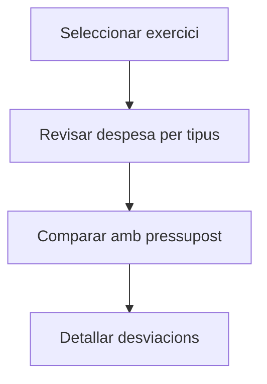

# Quadre de despeses

## Per a que serveix aquesta pantalla

El quadre de despeses és una vista de síntesi que mostra la despesa acumulada de l'exercici actiu desglossada per tipus de despesa. Permet visualitzar ràpidament el total de cada categoria, comparar amb pressupostos i detectar desviacions.

## Accions disponibles

- Seleccionar exercici
- Filtrar per tipus de despesa
- Revisar totals per categoria
- Comparar amb pressupost

## Flux habitual

1. Selecciona l'exercici actiu.
2. Revisa el resum de despeses per tipus.
3. Compara amb els pressupostos establerts.
4. Detalla per categoria si observes desviacions significatives.

## Aspectes importants

- El comportament concret de cada acció depèn de l'estat del cicle de vida de l'entitat.
- Les accions de creació, modificació i eliminació poden estar blocades segons l'estat.
- Alguns camps són de només lectura quan l'entitat ja forma part d'un document comercial vinculat.

## Errors frequents

- Si el quadre no mostra dades, comprova que l'exercici seleccionat tingui despeses registrades.

## Proces basic

