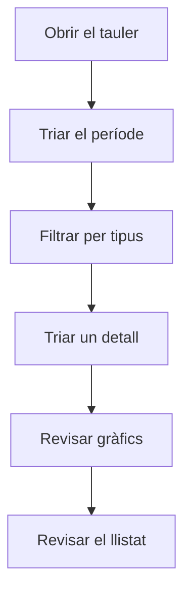

# Tauler de despeses

## Per a que serveix aquesta pantalla

Resumeix tot el que l'empresa ha de pagar en un període, sumant dues fonts: les despeses de «Gestió de despeses» (per data de pagament) i els venciments de les factures de compra (per data de venciment). Mostra l'import total, l'evolució per mesos i el repartiment per tipus de despesa o per proveïdor, i en dona el detall en una llista.

## Accions disponibles

- Triar el «Període»; per defecte és l'any en curs.
- Filtrar per «Tipus»: «Compra» (venciments de factures de compra) o «Despesa» (despeses generals).
- Filtrar per «Detall»: un tipus de despesa o un proveïdor concret, entre els que surten al gràfic per tipologia.
- Consultar la pestanya «Gràfics»: «Despeses agrupades mensualment» (barres per mes) i «Gràfic de despeses per tipologia» (pastís).
- Consultar la pestanya «Llistat»: una fila per cada despesa o venciment, amb tipus, detall, data de pagament, import i descripció.
- Netejar els filtres amb el botó «Netejar filtres» de la barra de filtres.

## Flux habitual

1. Obre «Tauler de despeses» i revisa la «Despesa total» de l'any en curs.
2. Ajusta el «Període» si vols un altre interval; el tauler s'actualitza sol en triar les dues dates.
3. Tria a «Tipus» si vols veure només compres o només despeses.
4. Mira al gràfic per tipologia quins tipus de despesa o proveïdors pesen més i, si cal, tria'n un a «Detall».
5. Passa a «Llistat» per veure les partides concretes que formen el total.

## Aspectes importants

- «Despesa total» és la suma dels imports de totes les partides que compleixen els filtres, les mateixes que surten a «Llistat».
- A les compres, l'import és el de cada venciment de la factura i la data és la de venciment, no la de la factura. Es compten totes les factures de compra, sigui quin sigui el seu estat.
- Al «Detall», les compres s'agrupen pel nom fiscal del proveïdor i les despeses pel nom del tipus de despesa.
- Les despeses recurrents hi surten un cop per cada pagament generat.
- Si registres com a despesa un pagament que també entra com a factura de compra, el tauler el comptarà dues vegades.
- Canviar el «Tipus» buida el filtre «Detall». Les opcions de «Detall» són les etiquetes que mostra en aquell moment el gràfic per tipologia.
- Aquest tauler és de consulta: no crea ni modifica res.

## Errors frequents

- Si el tauler no canvia en triar el període, comprova que hagis marcat la data d'inici i la de final.
- Si després de netejar els filtres els gràfics no canvien, torna a triar un «Període»: sense període no es recarreguen les dades.
- Si una factura de compra no hi surt, comprova que tingui venciments i que la data de venciment caigui dins del període.
- Si una despesa no hi surt, comprova la seva data de pagament a «Gestió de despeses».

## Proces basic

```mermaid
flowchart TD
    A[Obrir el tauler] --> B[Triar el període]
    B --> C[Filtrar per tipus]
    C --> D[Triar un detall]
    D --> E[Revisar gràfics]
    E --> F[Revisar el llistat]
```
