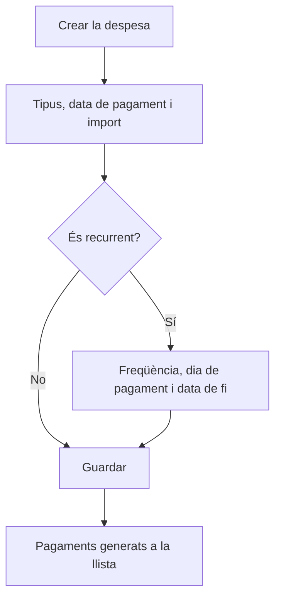

# Despesa

## Per a que serveix aquesta pantalla

És la fitxa d'una despesa general: un pagament que l'empresa registra fora de les factures de compra, classificat per tipus. S'obre en crear una despesa des de «Gestió de despeses» («Alta de despesa») o en obrir-ne una d'existent («Modificació de despesa»). Si la despesa es repeteix, aquí mateix defineixes cada quan i fins quan, i l'aplicació genera els pagaments futurs.

## Accions disponibles

- Triar el «Tipus» de despesa i informar la «Data d'alta», la «Data de pagament» i l'«Import».
- Marcar «Recurrent» per activar «Freqüència», «Dia de pagament» i «Data de fi».
- Escriure una «Descripció».
- Desar amb «Guardar», a la capçalera de la pantalla.

## Flux habitual

1. Des de «Gestió de despeses», prem «+».
2. Tria el «Tipus» i informa la «Data de pagament» i l'«Import».
3. Si és un pagament periòdic, marca «Recurrent», tria la «Freqüència» (mensual, bimensual, trimestral, semestral o anual), el «Dia de pagament» i la «Data de fi».
4. Afegeix una «Descripció» que identifiqui el pagament.
5. Prem «Guardar»: tornes a la llista, on ja surten la despesa i, si és recurrent, els pagaments generats.

## Aspectes importants

- «Tipus», «Data d'alta», «Data de pagament» i «Import» són obligatoris. Els tipus es mantenen a «Gestió de tipus de despesa».
- La «Data de pagament» és la que compta a la llista i al «Tauler de despeses».
- En crear una despesa recurrent, l'aplicació genera un pagament nou per cada període de la «Freqüència», amb el mateix tipus, import i descripció, fins a la «Data de fi», inclosa. Cap pagament generat no passa de la data de fi.
- Els pagaments generats cauen sempre el «Dia de pagament» de cada mes. Si el mes té menys dies (per exemple, el dia 31 al febrer), es fa servir l'últim dia del mes.
- En modificar una despesa recurrent, es desa la despesa que edites i es tornen a generar, amb les dades noves, els pagaments posteriors a la seva data de pagament. Els pagaments anteriors no canvien. Per canviar tota la sèrie, edita el primer pagament.
- Eliminar una despesa recurrent, des de la llista, elimina tota la sèrie.

## Errors frequents

- Si «Guardar» no fa res, revisa els missatges en vermell: falta el tipus, alguna data o l'import.
- Si el desplegable «Tipus» surt buit, torna a «Gestió de despeses» i obre la despesa des de la llista, que és la que carrega els tipus.
- Si has marcat «Recurrent», el formulari exigeix la «Freqüència», un «Dia de pagament» entre 1 i 31 i una «Data de fi» posterior a la «Data de pagament». Revisa els missatges en vermell d'aquests camps.
- Si després de modificar una despesa recurrent els pagaments anteriors no han canviat, és el comportament esperat: només es regeneren els posteriors. Edita el primer pagament de la sèrie per canviar-los tots.

## Proces basic

