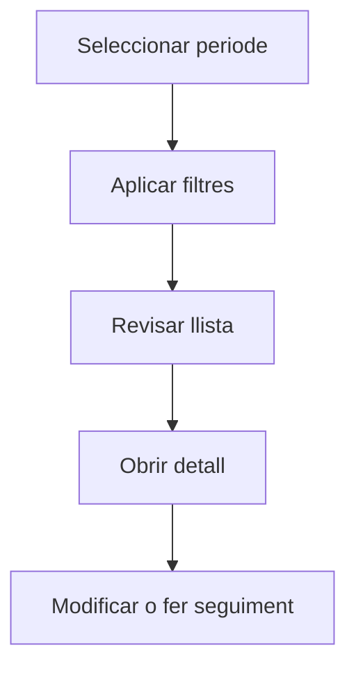

# Despeses

## Per a que serveix aquesta pantalla

La pantalla de despeses permet consultar i gestionar les despeses periòdiques de l'empresa en un periode seleccionat. Pots filtrar per tipus, proveïdor, centre de cost o estat, i accedir al detall per informar els imports i fer el seguiment del pagament.

## Accions disponibles

- Seleccionar periode
- Filtrar per tipus, proveïdor o estat
- Crear una despesa nova
- Obrir el detall d'una despesa

## Flux habitual

1. Selecciona el periode o exercici que vols consultar.
2. Aplica els filtres que necessitis per reduir el volum de resultats.
3. Revisa la llista i selecciona l'element que vulguis obrir.
4. Accedeix al detall per fer les modificacions o el seguiment que calgui.

## Aspectes importants

- El comportament concret de cada acció depèn de l'estat del cicle de vida de l'entitat.
- Les accions de creació, modificació i eliminació poden estar blocades segons l'estat.
- Alguns camps són de només lectura quan l'entitat ja forma part d'un document comercial vinculat.

## Errors frequents

- Si no es mostren despeses, comprova que el periode estigui seleccionat.
- Si no es pot marcar com a pagada, revisa que la data de pagament estigui informada.

## Proces basic

