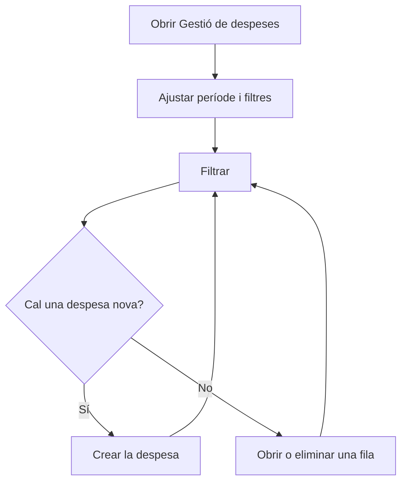

# Gestió de despeses

## Per a que serveix aquesta pantalla

Llista les despeses generals de l'empresa que es registren fora de les factures de compra, classificades per tipus de despesa. Per cada despesa veus el tipus, la descripció, la data de pagament, la freqüència i l'import, amb el total del període a peu de columna. Aquestes despeses alimenten el «Tauler de despeses» i el quadre comparatiu de flux de caixa.

## Accions disponibles

- Filtrar per «Període» (data de pagament), «Tipus» i «Freqüència», i aplicar-ho amb el botó «Filtrar».
- Tornar als filtres inicials amb «Netejar filtres».
- Crear una despesa amb el botó «+» («Crear nou»).
- Obrir una despesa fent clic a la fila per modificar-la.
- Eliminar una despesa amb la icona de paperera («Eliminar») de la fila, després de confirmar-ho.
- Ordenar per «Descripció» o «Data de pagament» fent clic a la capçalera de la columna.

## Flux habitual

1. Obre «Gestió de despeses»: la primera vegada mostra les despeses amb data de pagament dins de l'any en curs; després, recupera els últims filtres que vas fer servir.
2. Ajusta el «Període» i, si cal, el «Tipus» o la «Freqüència», i prem «Filtrar».
3. Revisa el total de la columna «Import».
4. Prem «+» per registrar una despesa nova, o fes clic en una fila per corregir-la.
5. Si una despesa sobra, elimina-la amb la paperera i confirma.

## Aspectes importants

- El «Període» filtra per data de pagament, no per data d'alta.
- Cada pagament d'una despesa recurrent és una fila pròpia, amb la seva data de pagament.
- Amb «Freqüència» a «No recurrent» es veuen només les despeses puntuals.
- Els filtres es desen per usuari en sortir de la pantalla. «Netejar filtres» torna a l'any en curs sense tipus ni freqüència.
- Eliminar és definitiu. Si la despesa és recurrent, s'elimina tota la sèrie: la despesa original i tots els pagaments generats, encara que només n'hagis triat un.

## Errors frequents

- Si falta una despesa que acabes de crear, comprova que la seva data de pagament caigui dins del «Període» i prem «Filtrar».
- Si en eliminar un pagament han desaparegut altres files, la despesa era recurrent: s'ha esborrat tota la sèrie i caldrà tornar-la a crear.
- Si la llista surt buida, revisa que el filtre de «Tipus» o «Freqüència» no sigui massa restrictiu.

## Proces basic

```mermaid
flowchart TD
    A[Obrir Gestió de despeses] --> B[Ajustar període i filtres]
    B --> C[Filtrar]
    C --> D{Cal una despesa nova?}
    D -->|Sí| E[Crear la despesa]
    D -->|No| F[Obrir o eliminar una fila]
    E --> C
    F --> C
```
