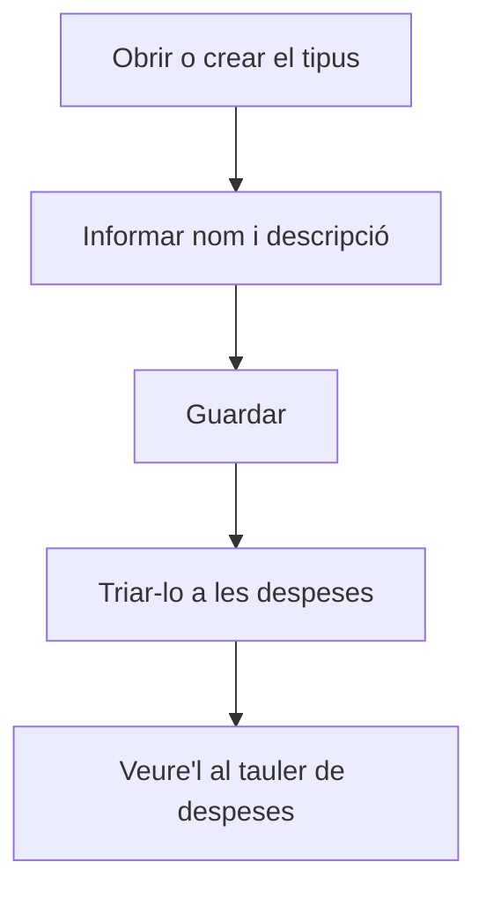

# Tipus de despesa

## Per a que serveix aquesta pantalla

És la fitxa d'un tipus de despesa. S'obre en crear un tipus des de «Gestió de tipus de despesa» («Alta de tipus de despesa») o en obrir-ne un d'existent. El nom que hi posis és el que triaràs al camp «Tipus» de cada despesa i el que veuràs al «Tauler de despeses».

## Accions disponibles

- Informar el «Nom» i la «Descripció».
- Marcar o desmarcar «Desactivada».
- Desar amb «Guardar», a la capçalera de la pantalla.

## Flux habitual

1. Des de «Gestió de tipus de despesa», prem «+» o obre un tipus existent.
2. Escriu un «Nom» curt i reconeixible: és l'etiqueta dels gràfics i dels filtres.
3. Escriu una «Descripció» que expliqui quines despeses hi van.
4. Prem «Guardar»: surt el missatge de confirmació i tornes a la llista.

## Aspectes importants

- «Nom» i «Descripció» són obligatoris i admeten fins a 250 caràcters cadascun. El nom ha de ser únic.
- Canviar el nom afecta totes les despeses del tipus: al «Tauler de despeses» i al quadre de flux de caixa apareixeran amb el nom nou.
- «Desactivada» no amaga el tipus: continua disponible al camp «Tipus» de les despeses.
- Per eliminar el tipus cal fer-ho des de la llista, i només es pot si no té despeses (vegeu l'ajuda de «Gestió de tipus de despesa»).

## Errors frequents

- Si «Guardar» no fa res, revisa els missatges en vermell sota els camps: falta el nom o la descripció.
- Si surt «L'entitat ja existeix», ja hi ha un altre tipus amb el mateix nom.

## Proces basic

