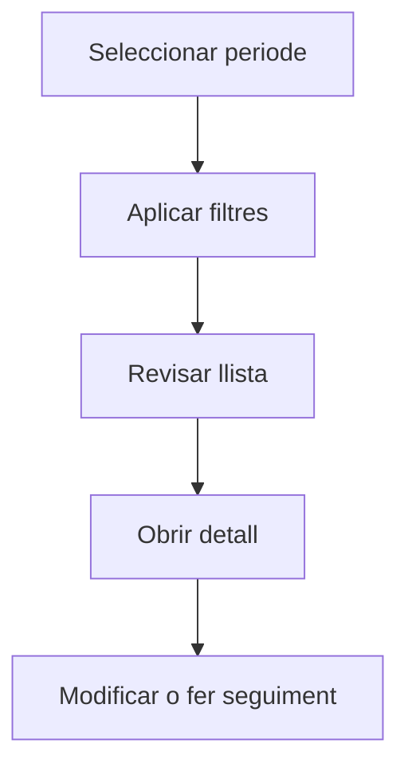

# Tipus de despesa

## Per a que serveix aquesta pantalla

La pantalla de tipus de despesa permet consultar el catàleg de categories utilitzades per classificar les despeses generals de l'empresa (sous, lloguers, subministraments, assegurances, etc.). Cada tipus de despesa té un codi, una descripció i un gestor associat.

## Accions disponibles

- Crear un tipus de despesa
- Obrir el detall d'un tipus
- Eliminar un tipus

## Flux habitual

1. Selecciona el periode o exercici que vols consultar.
2. Aplica els filtres que necessitis per reduir el volum de resultats.
3. Revisa la llista i selecciona l'element que vulguis obrir.
4. Accedeix al detall per fer les modificacions o el seguiment que calgui.

## Aspectes importants

- El comportament concret de cada acció depèn de l'estat del cicle de vida de l'entitat.
- Les accions de creació, modificació i eliminació poden estar blocades segons l'estat.
- Alguns camps són de només lectura quan l'entitat ja forma part d'un document comercial vinculat.

## Errors frequents

- Si no es pot crear un tipus, comprova que el codi no estigui duplicat.
- Si el tipus no apareix a la llista, assegura't que estigui actiu.

## Proces basic

