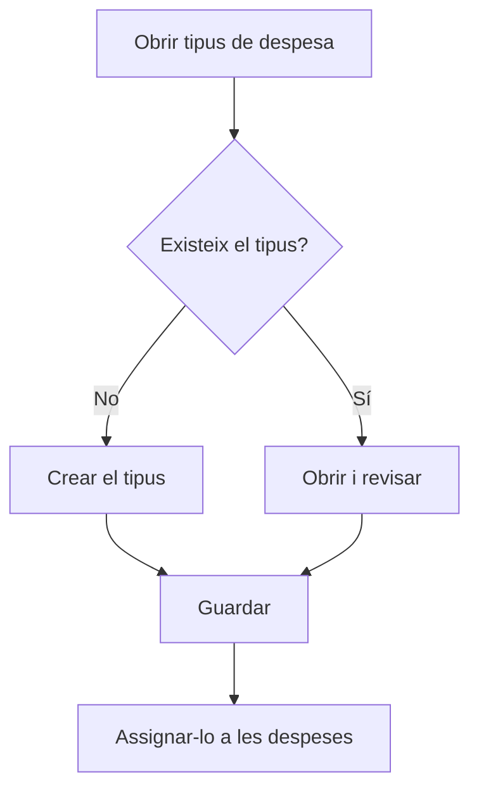

# Gestió de tipus de despesa

## Per a que serveix aquesta pantalla

Llista els tipus de despesa, el catàleg que classifica les despeses generals de l'empresa que es registren a «Gestió de despeses», fora de les factures de compra. Cada despesa de «Gestió de despeses» té un tipus, i el «Tauler de despeses» agrupa per tipus les despeses al gràfic per tipologia.

## Accions disponibles

- Crear un tipus amb el botó «+» («Crear nou»), a dalt de la llista.
- Obrir un tipus fent clic a la fila per modificar-ne el nom, la descripció o «Desactivada».
- Eliminar un tipus amb la icona de paperera («Eliminar») de la fila, després de confirmar-ho.

## Flux habitual

1. Obre «Gestió de tipus de despesa».
2. Revisa a les columnes «Nom» i «Descripció» si el tipus que necessites ja existeix.
3. Si no hi és, prem «+», omple el nom i la descripció i desa amb «Guardar».
4. Ves a «Gestió de despeses» i fes servir el tipus nou al camp «Tipus» de les despeses.

## Aspectes importants

- Eliminar un tipus de despesa esborra definitivament el tipus i també totes les despeses que el tenen assignat. Aquestes despeses desapareixen de «Gestió de despeses», del «Tauler de despeses» i del quadre de flux de caixa.
- El nom del tipus és el que apareix al «Tauler de despeses» (filtre «Detall» i gràfic per tipologia) quan el tipus és «Despesa». Si el canvies, les despeses ja registrades es mostren amb el nom nou.
- Marcar un tipus com a «Desactivada» només queda com a indicació a la llista: el tipus continua disponible al desplegable «Tipus» de les despeses i als filtres.
- La llista no té filtres: mostra sempre tots els tipus.

## Errors frequents

- Abans d'eliminar un tipus, comprova a «Gestió de despeses», filtrant per aquest «Tipus» i amb un període ampli, que no tingui despeses que vulguis conservar.
- Si en crear-lo surt «L'entitat ja existeix», ja hi ha un tipus amb aquest nom.

## Proces basic

```mermaid
flowchart TD
    A[Obrir tipus de despesa] --> B{Existeix el tipus?}
    B -->|No| C[Crear el tipus]
    B -->|Sí| D[Obrir i revisar]
    C --> E[Guardar]
    D --> E
    E --> F[Assignar-lo a les despeses]
```
