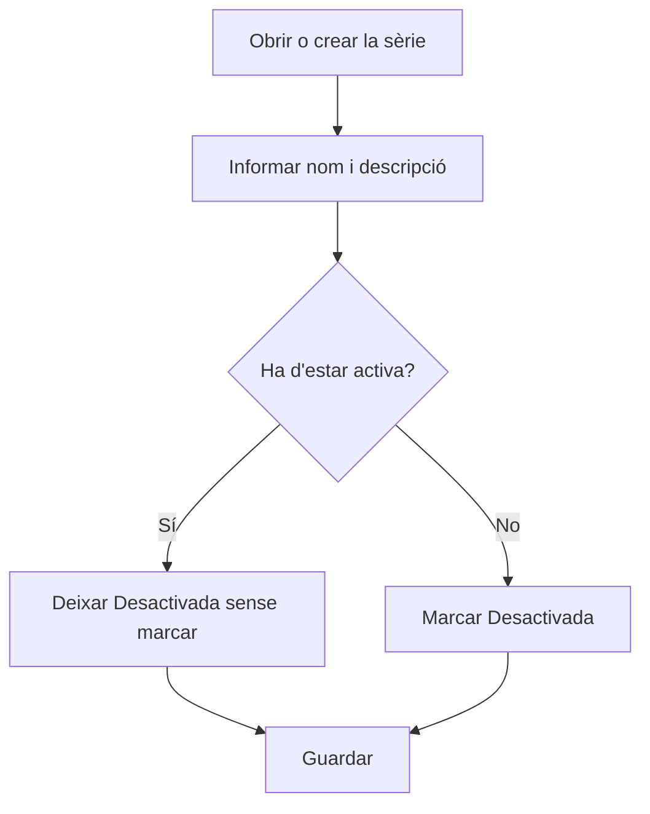

# Sèrie de facturació

## Per a que serveix aquesta pantalla

És la fitxa d'una sèrie de factures de compra. Aquí defineixes el nom amb què la triaràs al camp «Sèrie» de la factura de compra, una descripció i si està activa. S'obre en crear una sèrie des de «Sèries de factures de compra» («Alta de sèrie de facturació») o en obrir-ne una d'existent.

## Accions disponibles

- Informar el «Nom de la sèrie» i la «Descripció».
- Marcar o desmarcar «Desactivada».
- Informar «Prefix», «Sufix», «Número següent» i «Longitud».
- Desar amb «Guardar», a la capçalera de la pantalla.

## Flux habitual

1. Des de «Sèries de factures de compra», prem «+» o obre una sèrie existent.
2. Escriu el «Nom de la sèrie», que és el que veuràs al desplegable de la factura.
3. Escriu una «Descripció» que expliqui quan s'ha de fer servir.
4. Deixa «Desactivada» sense marcar si la sèrie s'ha de poder triar.
5. Prem «Guardar»: surt el missatge de confirmació i tornes a la llista.

## Aspectes importants

- «Nom de la sèrie» i «Descripció» són obligatoris. El nom admet fins a 50 caràcters i ha de ser únic; la descripció, fins a 250.
- «Prefix», «Sufix», «Número següent» i «Longitud» es desen amb la sèrie, però actualment no s'utilitzen per numerar les factures de compra. El número intern de la factura el dona el comptador «Factures de compra» de l'exercici (pantalla «Exercicis»).
- El formulari exigeix igualment que «Número següent» sigui un enter positiu i que «Longitud» sigui un enter entre 1 i 20. «Prefix» i «Sufix» admeten fins a 10 caràcters.
- Si marques «Desactivada», la sèrie ja no es podrà triar a les factures de compra, però les factures que ja la tenen assignada no canvien.
- Si la sèrie es diu «Nacional», les factures de compra noves la proposaran per defecte. Canviar-li el nom fa que deixin de proposar-la.

## Errors frequents

- Si «Guardar» no fa res, revisa els missatges en vermell sota els camps: normalment falta el nom o la descripció.
- Si surt «L'entitat ja existeix», ja hi ha una altra sèrie amb el mateix nom.
- Si la «Longitud» no s'accepta, ha de ser un número enter entre 1 i 20.
- Si la sèrie no apareix a la factura de compra després de desar, comprova que «Desactivada» no estigui marcada.

## Proces basic

