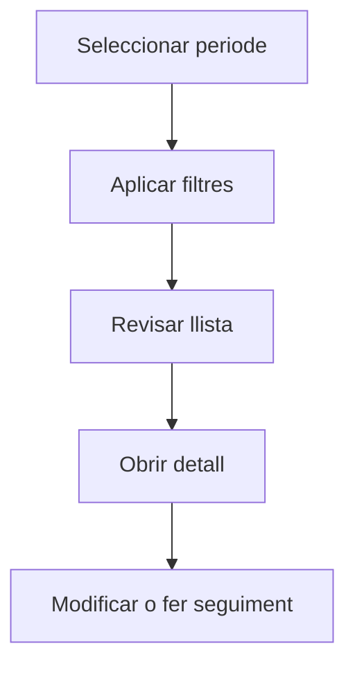

# Sèries de factura

## Per a que serveix aquesta pantalla

La pantalla de sèries de factura permet consultar i gestionar les sèries documentals utilitzades per numerar les factures de compra. Cada sèrie té un prefix, un comptador actual i un estat que determina si està activa.

## Accions disponibles

- Crear una sèrie de factura
- Obrir el detall d'una sèrie
- Activar o desactivar una sèrie

## Flux habitual

1. Selecciona el periode o exercici que vols consultar.
2. Aplica els filtres que necessitis per reduir el volum de resultats.
3. Revisa la llista i selecciona l'element que vulguis obrir.
4. Accedeix al detall per fer les modificacions o el seguiment que calgui.

## Aspectes importants

- El comportament concret de cada acció depèn de l'estat del cicle de vida de l'entitat.
- Les accions de creació, modificació i eliminació poden estar blocades segons l'estat.
- Alguns camps són de només lectura quan l'entitat ja forma part d'un document comercial vinculat.

## Errors frequents

- Si no es mostren dades, comprova que el filtre estigui ben informat.
- Si l'operació falla, revisa que totes les dades obligatòries estiguin informades.

## Proces basic

