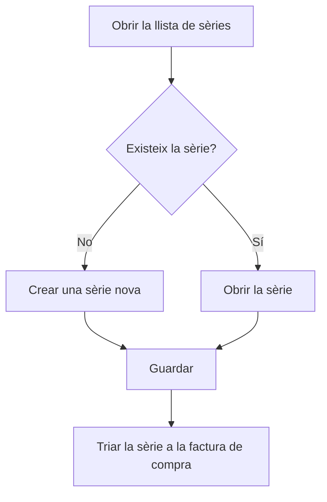

# Sèries de factures de compra

## Per a que serveix aquesta pantalla

Llista les sèries de facturació que es poden assignar a les factures de compra. La sèrie és el camp «Sèrie» de la factura de compra i serveix per classificar-la. Des d'aquí crees sèries noves, obres les existents per modificar-les i elimines les que ja no calen.

## Accions disponibles

- Crear una sèrie amb el botó «+» («Crear nou»), a dalt de la llista.
- Obrir una sèrie fent clic a la fila per modificar-la a «Sèrie de facturació».
- Eliminar una sèrie amb la icona de paperera («Eliminar») de la fila, després de confirmar-ho.
- Consultar d'un cop d'ull quines sèries estan desactivades a la columna «Desactivada».

## Flux habitual

1. Obre «Sèries de factures de compra».
2. Revisa si ja existeix la sèrie que necessites a les columnes «Nom de la sèrie» i «Descripció».
3. Si no hi és, prem «+» i omple la fitxa de la sèrie.
4. Desa amb «Guardar»: tornes a la llista, que ja mostra la sèrie nova.
5. Quan una sèrie deixi d'utilitzar-se, obre-la i marca «Desactivada» en lloc d'eliminar-la.

## Aspectes importants

- La sèrie no numera les factures. El «Núm. de factura interna» de la factura de compra surt del comptador «Factures de compra» de l'exercici que correspon a la data de la factura (pantalla «Exercicis»).
- Les factures de compra noves proposen per defecte la sèrie que es diu «Nacional», si existeix i està activa.
- Les sèries marcades com a «Desactivada» deixen d'aparèixer al desplegable «Sèrie» de la factura de compra.
- Eliminar una sèrie l'esborra definitivament. No es pot eliminar una sèrie que ja tenen assignada factures de compra.
- Aquesta llista no té filtres: mostra sempre totes les sèries, actives i desactivades.

## Errors frequents

- Si l'eliminació falla, comprova si la sèrie ja s'ha fet servir en alguna factura de compra; en aquest cas, desactiva-la.
- Si una sèrie no surt al desplegable «Sèrie» de la factura, comprova que no estigui marcada com a «Desactivada».
- Si en crear-la surt «L'entitat ja existeix», ja hi ha una sèrie amb aquest nom: tria'n un altre.

## Proces basic

```mermaid
flowchart TD
    A[Obrir la llista de sèries] --> B{Existeix la sèrie?}
    B -->|No| C[Crear una sèrie nova]
    B -->|Sí| D[Obrir la sèrie]
    C --> E[Guardar]
    D --> E
    E --> F[Triar la sèrie a la factura de compra]
```
