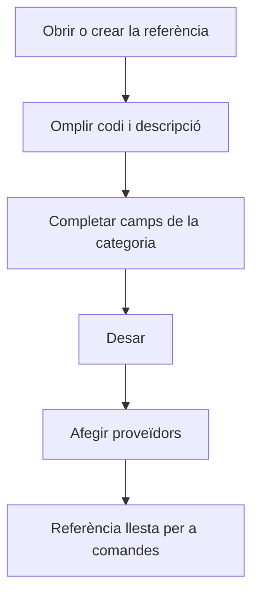

# Referència de compra

## Per a que serveix aquesta pantalla

És la fitxa d'una referència de compra: un material, una eina o un servei. Hi defineixes les dades que fan servir les comandes de compra i els albarans de recepció, i a la part inferior, quins proveïdors la serveixen i en quines condicions. La cerca i la creació es fan des de la pantalla «Referències de compra».

## Accions disponibles

- Omplir o modificar les dades de la referència i desar-les amb «Desar», a la capçalera de la pantalla.
- Afegir un proveïdor a la taula «Proveïdors» amb el botó «+», indicant «Proveïdor», «Codi de proveïdor», «Descripció del proveïdor», «Preu del proveïdor» i «Dies de subministrament».
- Editar les condicions d'un proveïdor fent clic a la seva fila.
- Treure un proveïdor amb la «X» de la fila, després de confirmar-ho.

## Flux habitual

1. Des de «Referències de compra», tria la categoria i prem «+», o obre una referència existent.
2. Omple «Codi» i «Descripció».
3. Completa els camps de la categoria: per a un material, «Tipus de material», «Format» i «Impost»; per a una eina, «Impost» i «Àrea de producció»; per a un servei, «Preu del servei» i «Preu del transport».
4. Prem «Desar».
5. A la taula «Proveïdors», afegeix els proveïdors que la serveixen amb el seu preu i els dies de subministrament.

## Aspectes importants

- La «Categoria» ve de la llista des d'on l'has creada i no es pot canviar.
- «Codi» (fins a 50 caràcters) i «Descripció» (fins a 250) són obligatoris en totes les categories.
- Materials: «Tipus de material», «Format» i «Impost» són obligatoris. En desar, el codi es completa automàticament amb el nom del tipus de material entre parèntesis.
- Materials: «Últim cost» s'actualitza sol cada vegada que es desa un albarà de recepció amb aquest material. Quan el material ja té albarans, el camp queda bloquejat.
- Eines: «Impost» i «Àrea de producció» són obligatoris, i el format s'assigna automàticament a unitats.
- Serveis: «Preu del servei» i «Preu del transport» són obligatoris; «Impost» és opcional.
- Materials i serveis tenen la casella «Desactivada».
- En crear una referència nova et quedes a la fitxa per poder afegir-hi proveïdors; en desar una referència existent tornes a la pantalla anterior.
- Les dades de la taula «Proveïdors» són les mateixes que la pestanya «Referències» de la fitxa del proveïdor. En afegir la referència a una comanda de compra d'aquest proveïdor, se'n proposen el preu, la descripció i la data prevista (avui més els dies de subministrament).

## Errors frequents

- Si en crear surt «El material ja existeix», la referència no s'ha pogut crear: revisa que no l'hagis desat ja i torna a obrir-la des de la llista.
- Si no es desa, revisa els missatges sota els camps obligatoris de la categoria, per exemple «L'IVA és obligatori» o «El format és obligatori».
- Si no pots modificar «Últim cost», el material ja té albarans de recepció i el cost es manté des d'allà.
- Si en afegir un proveïdor surt «La referència ja existeix», aquest proveïdor ja hi és: edita la seva fila.

## Proces basic

