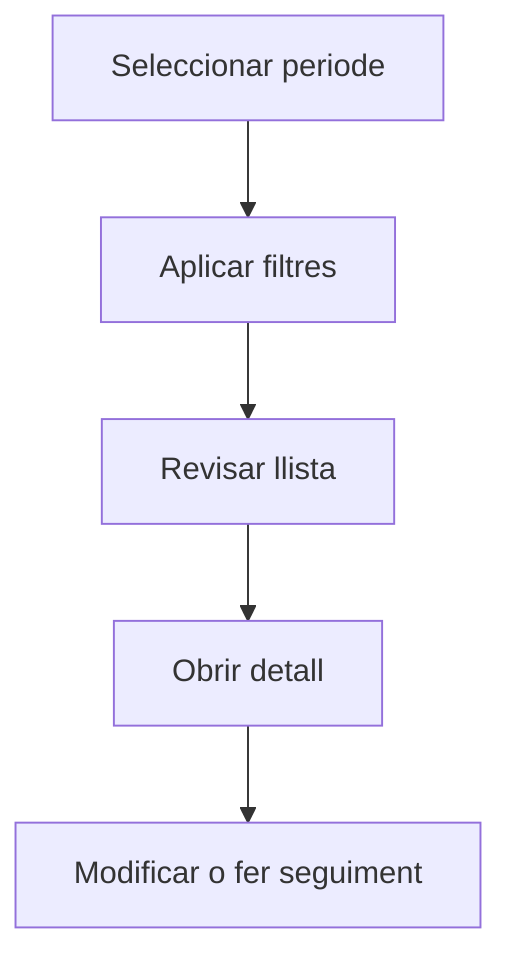

# Materials

## Per a que serveix aquesta pantalla

La pantalla de materials permet consultar el catàleg de materials utilitzats en el procés productiu. Des d'aquí pots filtrar per tipus, cercar per codi o descripció, i accedir al detall de cada material per gestionar les seves dades logístiques.

## Accions disponibles

- Filtrar per tipus de material
- Cercar per codi o descripció
- Crear un material nou
- Obrir el detall d'un material existent
- Eliminar un material

## Flux habitual

1. Selecciona el periode o exercici que vols consultar.
2. Aplica els filtres que necessitis per reduir el volum de resultats.
3. Revisa la llista i selecciona l'element que vulguis obrir.
4. Accedeix al detall per fer les modificacions o el seguiment que calgui.

## Aspectes importants

- El comportament concret de cada acció depèn de l'estat del cicle de vida de l'entitat.
- Les accions de creació, modificació i eliminació poden estar blocades segons l'estat.
- Alguns camps són de només lectura quan l'entitat ja forma part d'un document comercial vinculat.

## Errors frequents

- Si no es mostren materials, comprova que el filtre de tipus no estigui buit o que hi hagi materials creats.
- Si no es pot eliminar un material, revisa si està utilitzat en alguna comanda o recepta.

## Proces basic

