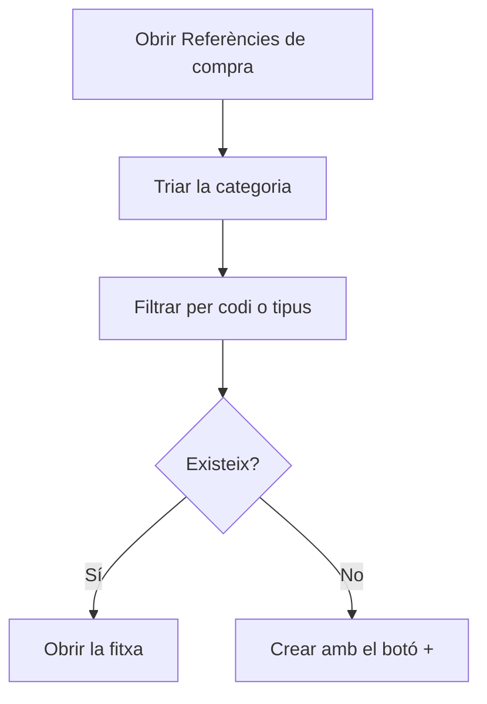

# Referències de compra

## Per a que serveix aquesta pantalla

És el catàleg de les referències que es compren: materials, eines i serveis. Aquestes referències són les que es trien a les línies de les comandes de compra i dels albarans de recepció. Des d'aquí les cerques per categoria, obres la fitxa de cadascuna, en crees de noves o elimines les que no s'han fet servir.

## Accions disponibles

- Triar la «Categoria» (Material, Eina o Servei) per veure'n les referències.
- Cercar per «Codi» i, en la categoria Material, filtrar per «Tipus» de material.
- Netejar el codi i el tipus amb «Netejar».
- Crear una referència de la categoria seleccionada amb el botó «+» («Crear nou»).
- Obrir la fitxa d'una referència fent clic a la fila.
- Eliminar una referència amb la «X» de la fila, després de confirmar-ho.

## Flux habitual

1. Obre la pantalla «Referències de compra».
2. Tria la «Categoria» que vols consultar.
3. Escriu part del codi a «Codi» o, si són materials, tria un «Tipus».
4. Fes clic a la fila per obrir la fitxa i revisar-la o modificar-la.
5. Si la referència no existeix, prem «+» i omple la fitxa nova.

## Aspectes importants

- Sense una categoria triada, la llista surt buida.
- El filtre «Tipus» només s'activa per a la categoria Material.
- Les columnes canvien segons la categoria: els materials mostren «Tipus», «Format» i «Densitat (mm)»; els serveis, «Preu» i «Transport»; les eines, l'«Àrea».
- El botó «+» crea una referència de la categoria que tens seleccionada. Tria-la abans de crear.
- En tornar a la pantalla es recuperen els últims filtres que havies fet servir.
- L'eliminació és definitiva. Abans d'eliminar, l'aplicació comprova si la referència té dependències, per exemple comandes, albarans de recepció, estoc o lots, moviments de magatzem, una ruta o ordres de fabricació, o si forma part d'una llista de materials o d'una tarifa de compra. Si en té, no s'elimina.

## Errors frequents

- Si la llista surt buida, comprova que hagis triat una «Categoria» i que el filtre «Codi» no sigui massa restrictiu.
- Si no pots triar un «Tipus», canvia la categoria a Material.
- Si en eliminar surt «Referència amb dependències:», llegeix els motius que s'hi detallen: la referència ja s'ha fet servir i s'ha de conservar.

## Proces basic

```mermaid
flowchart TD
    A[Obrir Referències de compra] --> B[Triar la categoria]
    B --> C[Filtrar per codi o tipus]
    C --> D{Existeix?}
    D -->|Sí| E[Obrir la fitxa]
    D -->|No| F[Crear amb el botó +]
```
