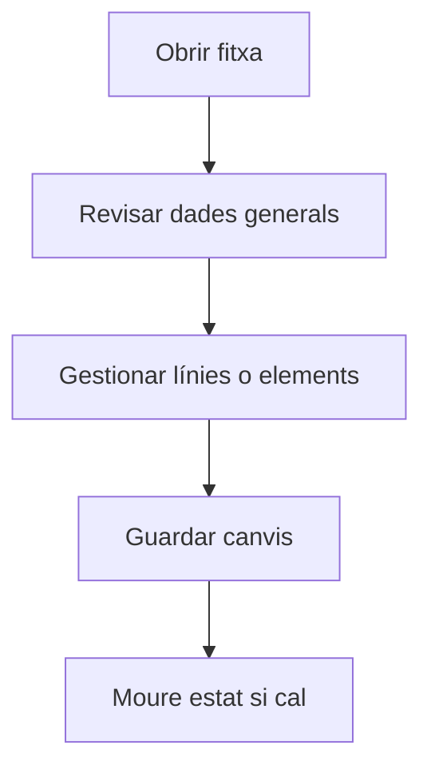

# Comanda de compra

## Per a que serveix aquesta pantalla

Pantalla de gestió de l'entitat.

## Accions disponibles

- Guardar la capçalera de la comanda
- Afegir, editar i eliminar línies
- Associar albarans de recepció
- Crear una recepció des de la comanda
- Eliminar línies de comanda
- Canviar l'estat del cicle de vida

## Flux habitual

1. Revisa les dades generals de la fitxa.
2. Gestiona les línies o els elements associats segons calgui.
3. Guarda els canvis quan hagueu acabat.
4. Si la fitxa té un cicle de vida, mou l'estat segons correspongui.

## Aspectes importants

- El comportament concret de cada acció depèn de l'estat del cicle de vida de l'entitat.
- Les accions de creació, modificació i eliminació poden estar blocades segons l'estat.
- Alguns camps són de només lectura quan l'entitat ja forma part d'un document comercial vinculat.

## Errors frequents

- Si no es pot desar la comanda, comprova que el proveïdor i la data estiguin informats.
- Si les línies no es poden afegir, revisa que hi hagi materials amb tarifes definides pel proveïdor.

## Proces basic

