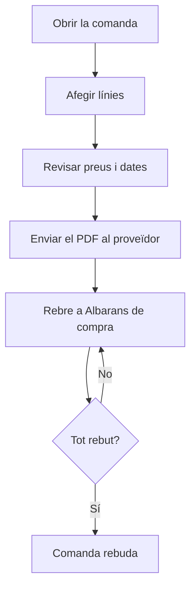

# Comanda de compra

## Per a que serveix aquesta pantalla

És la fitxa d'una comanda de compra a un proveïdor: la capçalera amb l'exercici, la data, l'estat i el proveïdor, i les línies amb el que es demana. Permet seguir quant s'ha rebut de cada línia i en quin albarà, i treure el document de la comanda per enviar-lo al proveïdor. Les línies pendents es reben després a «Albarans de compra», que és el pas previ a la factura de compra.

## Accions disponibles

- Modificar «Exercici», «Data de comanda», «Estat» i «Proveïdor» i desar amb «Desar».
- Descarregar el document de la comanda en Word amb «Descarregar», al desplegable del botó «Desar».
- Descarregar la comanda en PDF amb «Imprimir PDF», al mateix desplegable.
- Afegir una línia amb el botó «+» de «Detall de la comanda».
- Modificar una línia fent clic a la fila.
- Eliminar una línia amb la «X», després de confirmar-ho.
- Desplegar una línia amb la fletxa de l'esquerra per veure'n les recepcions: «Albarà», «Quantitat», «Data» i «Usuari». El número d'albarà obre l'albarà de recepció.
- Obrir la fitxa de la referència amb l'enllaç de la columna «Referència».

## Flux habitual

1. Obre la comanda des de «Comandes de compra», o just després de crear-la.
2. Prem «+» a «Detall de la comanda» i tria la «Referència de compra».
3. Revisa la descripció, la «Data prevista» i el «Preu» proposats, informa la «Quantitat» i prem «Crear».
4. Repeteix-ho per a cada línia.
5. Descarrega la comanda amb «Imprimir PDF» o «Descarregar» per enviar-la al proveïdor.
6. Quan arribi el material, registra'l a «Albarans de compra» amb «Afegir des de comanda»; la columna «Q. rebuda» d'aquesta comanda s'actualitzarà sola.

## Aspectes importants

- El «Número» es genera en crear la comanda i no es pot modificar.
- El desplegable «Estat» només ofereix els estats als quals es pot passar des de l'estat actual, segons el cicle de vida de les comandes de compra configurat a «Cicles de vida».
- En desar la capçalera amb «Desar», tornes a la pantalla anterior.
- En triar la referència d'una línia, si el proveïdor de la comanda la té a les seves referències, es proposen el seu preu, la seva descripció i la data prevista (avui més els dies de subministrament). Si no la té, es proposen el preu i la descripció de la fitxa de la referència.
- El camp «Preu» de la línia és l'import total: es calcula com quantitat per preu unitari. Per als serveis, el preu no es multiplica per la quantitat. El «Preu unit.» es recalcula en desar a partir de l'import i la quantitat.
- La «Quantitat» ha de ser com a mínim 1, i la referència i la descripció són obligatòries.
- Quan una línia ja té quantitat rebuda, no se'n pot canviar la referència, la quantitat ni el preu, i desapareix la «X» per eliminar-la.
- En rebre material a un albarà, l'estat de la línia passa automàticament a rebuda parcialment o rebuda segons la quantitat. Quan totes les línies estan rebudes, o totes cancel·lades, l'estat de la comanda canvia automàticament.
- Si treus una recepció d'un albarà, la quantitat rebuda de la línia es descompta i l'estat es recalcula.
- Les línies creades des de «Generació de comandes de compra» queden vinculades a la fase de l'ordre de fabricació.

## Errors frequents

- Si no es desa la capçalera, revisa que «Exercici», «Data de comanda», «Estat» i «Proveïdor» estiguin informats.
- Si en crear una línia surt «La quantitat ha de ser superior a 1», informa una quantitat d'1 o més.
- Si una línia no proposa preu ni data prevista, el proveïdor no té aquesta referència a la pestanya «Referències» de la seva fitxa: afegeix-la-hi.
- Si no pots modificar la quantitat o el preu d'una línia, ja s'ha rebut material d'aquesta línia.
- Si surt «No s'ha pogut generar el full de la comanda», torna-ho a provar o fes servir «Imprimir PDF».

## Proces basic

```mermaid
flowchart TD
    A[Obrir la comanda] --> B[Afegir línies]
    B --> C[Revisar preus i dates]
    C --> D[Enviar el PDF al proveïdor]
    D --> E[Rebre a Albarans de compra]
    E --> F{Tot rebut?}
    F -->|Sí| G[Comanda rebuda]
    F -->|No| E
```
