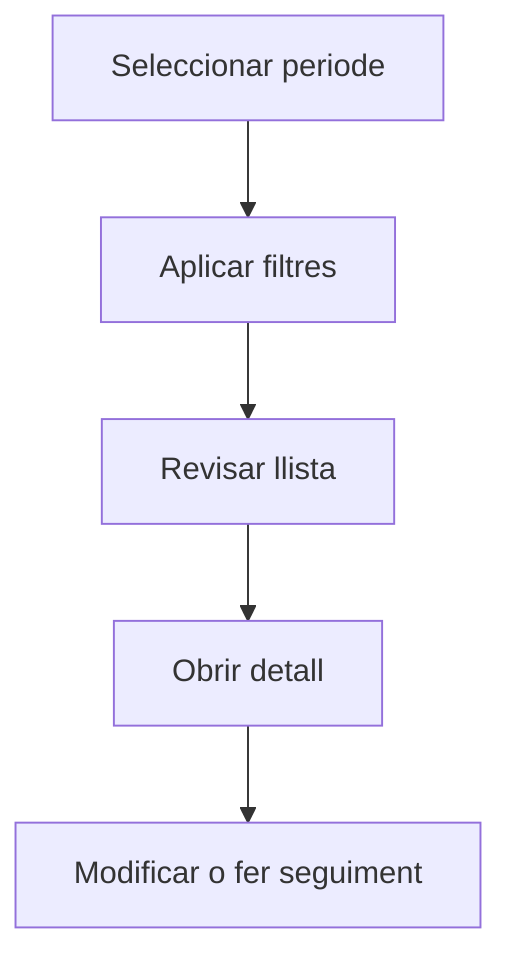

# Comandes de compra

## Per a que serveix aquesta pantalla

La pantalla de comandes de compra permet consultar les comandes emeses a proveïdors en un periode determinat. Pots filtrar per proveïdor, estat, referència interna o centre de cost, i accedir al detall de cada comanda per fer-ne el seguiment.

## Accions disponibles

- Seleccionar periode de treball
- Filtrar per proveïdor, estat o referència
- Netejar filtres
- Crear una comanda nova
- Obrir el detall d'una comanda

## Flux habitual

1. Selecciona el periode o exercici que vols consultar.
2. Aplica els filtres que necessitis per reduir el volum de resultats.
3. Revisa la llista i selecciona l'element que vulguis obrir.
4. Accedeix al detall per fer les modificacions o el seguiment que calgui.

## Aspectes importants

- El comportament concret de cada acció depèn de l'estat del cicle de vida de l'entitat.
- Les accions de creació, modificació i eliminació poden estar blocades segons l'estat.
- Alguns camps són de només lectura quan l'entitat ja forma part d'un document comercial vinculat.

## Errors frequents

- Si no es mostren comandes, comprova que hi hagi un periode seleccionat.
- Si no es pot crear una comanda, revisa que el proveïdor tingui adreça de lliurament informada.

## Proces basic

