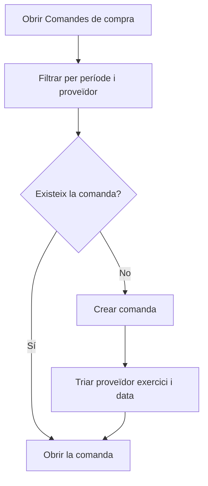

# Comandes de compra

## Per a que serveix aquesta pantalla

Llista les comandes de compra fetes als proveïdors en un període. És el primer pas del circuit de compres: comanda de compra -> albarà de recepció -> factura de compra. Des d'aquí cerques una comanda per fer-ne el seguiment, en crees una de nova o elimines les que encara no s'han tramitat.

## Accions disponibles

- Filtrar per «Període» i «Proveïdor» i aplicar el filtre amb «Filtrar».
- Tornar al filtre inicial amb «Netejar».
- Crear una comanda amb el botó «+» («Crear nou»): s'obre el diàleg «Crear comanda».
- Obrir una comanda fent clic a la fila.
- Eliminar una comanda amb la «X» de la fila, després de confirmar-ho.

## Flux habitual

1. Obre la pantalla «Comandes de compra»: surten les comandes de l'any en curs.
2. Ajusta el «Període» o tria un «Proveïdor» i prem «Filtrar».
3. Fes clic a una comanda per veure'n les línies i l'estat de recepció.
4. Per fer una comanda nova, prem «+», tria «Proveïdor», «Exercici» i «Data» i prem «Crear».
5. S'obre directament la comanda nova per afegir-hi les línies.

## Aspectes importants

- En obrir la pantalla, el període és l'any en curs. «Netejar» treu el proveïdor i torna a posar l'any en curs.
- La llista mostra «Número», «Data», «Proveïdor» i «Estat».
- El número de comanda s'assigna automàticament amb el comptador de l'exercici triat; no s'escriu a mà.
- Al diàleg «Crear comanda», l'«Exercici» es proposa amb el de l'any en curs si està actiu.
- Tota comanda nova neix amb l'estat inicial del cicle de vida de les comandes de compra, configurat a «Cicles de vida».
- La «X» per eliminar només apareix mentre la comanda és a l'estat inicial. L'eliminació és definitiva. Si la comanda s'havia generat des d'una fase d'OF, la fase torna a quedar disponible a «Generació de comandes de compra».
- Les comandes també es poden crear automàticament des de «Generació de comandes de compra», a partir de les fases externes de les ordres de fabricació.

## Errors frequents

- Si surt «Selecciona un període», el període està incomplet: tria una data d'inici i una de fi.
- Si no trobes una comanda, revisa que la seva data sigui dins del període i que el filtre de proveïdor sigui el correcte.
- Si no apareix la «X» per eliminar, la comanda ja no és a l'estat inicial.
- Si no es pot crear la comanda i surt «L'exercici no existeix» o «Error al crear el comptador», revisa l'exercici triat i el seu comptador de comandes de compra.
- Si surt que el cicle de vida no existeix o no té un estat inicial, cal revisar el cicle de vida de les comandes de compra a «Cicles de vida».

## Proces basic

```mermaid
flowchart TD
    A[Obrir Comandes de compra] --> B[Filtrar per període i proveïdor]
    B --> C{Existeix la comanda?}
    C -->|Sí| D[Obrir la comanda]
    C -->|No| E[Crear comanda]
    E --> F[Triar proveïdor exercici i data]
    F --> D
```
