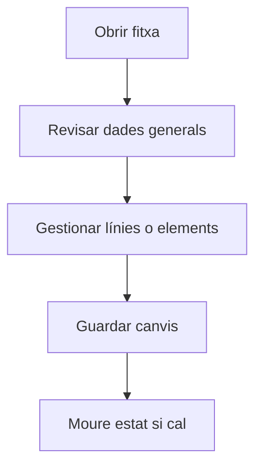

# Fase a comanda de compra

## Per a que serveix aquesta pantalla

La pantalla de fase a comanda de compra permet iniciar una comanda de compra des d'una fase d'una ordre de producció. Seleccionant la fase i informant les dades inicials, el sistema genera automàticament la comanda de compra amb el proveïdor associat al material o servei.

## Accions disponibles

- Seleccionar la fase d'ordre de producció
- Informar el proveïdor
- Seleccionar materials o serveis a comprar
- Generar la comanda de compra

## Flux habitual

1. Revisa les dades generals de la fitxa.
2. Gestiona les línies o els elements associats segons calgui.
3. Guarda els canvis quan hagueu acabat.
4. Si la fitxa té un cicle de vida, mou l'estat segons correspongui.

## Aspectes importants

- El comportament concret de cada acció depèn de l'estat del cicle de vida de l'entitat.
- Les accions de creació, modificació i eliminació poden estar blocades segons l'estat.
- Alguns camps són de només lectura quan l'entitat ja forma part d'un document comercial vinculat.

## Errors frequents

- Si no es mostren fases, comprova que hi hagi ordres de producció amb fases pendents de comprar.
- Si la comanda no es genera, revisa que la fase tingui un proveïdor associat.

## Proces basic

