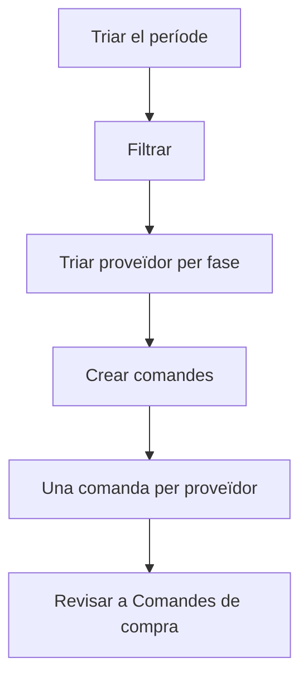

# Generació de comandes de compra

## Per a que serveix aquesta pantalla

Genera comandes de compra a partir de les fases externes de les ordres de fabricació, és a dir, les fases que fa un proveïdor (per exemple, un tractament o un servei subcontractat). Tries el proveïdor de cada fase i l'aplicació crea les comandes agrupades per proveïdor. El circuit continua com qualsevol compra: comanda de compra -> albarà de recepció -> factura de compra.

## Accions disponibles

- Triar el «Període» i carregar les fases amb «Filtrar».
- Tornar el període a l'any en curs amb «Netejar».
- Triar el proveïdor de cada fase al desplegable de la columna «Proveïdor».
- Treure el proveïdor d'una fase amb la creu del desplegable, perquè no es demani.
- Crear les comandes de totes les fases amb proveïdor amb «Crear comandes».

## Flux habitual

1. Obre la pantalla «Generació de comandes de compra».
2. Revisa el «Període» i prem «Filtrar» per carregar les fases pendents.
3. Per a cada fase que vulguis encarregar, tria el proveïdor a la columna «Proveïdor».
4. Prem «Crear comandes».
5. En acabar, l'aplicació t'envia a «Comandes de compra», on trobaràs les comandes noves per revisar-les i enviar-les.

## Aspectes importants

- La llista no es carrega sola: cal prémer «Filtrar». En obrir la pantalla es recupera l'últim període que havies fet servir o, si no n'hi ha, l'any en curs.
- Surten les fases marcades com a treball extern que tenen una referència de servei i que encara no tenen comanda de compra. L'ordre de fabricació ha de tenir la data planificada dins del període i estar en un estat marcat per a serveis externs al cicle de vida de les ordres de fabricació («Cicles de vida»).
- El desplegable «Proveïdor» mostra els proveïdors que tenen la referència de servei de la fase a la pestanya «Referències» de la seva fitxa. Si cap proveïdor la té, el desplegable surt buit.
- Es crea una comanda per proveïdor amb totes les seves fases, amb data d'avui i a l'exercici que inclou la data d'avui. El número s'assigna automàticament.
- Cada fase genera una línia amb la referència de servei i la «Quantitat planificada» de l'OF. El preu unitari és el «Preu del proveïdor» de la referència o, si el proveïdor no la té, l'últim cost de la referència. La data prevista és avui més els dies de subministrament del proveïdor.
- Un cop creada la comanda, la fase hi queda vinculada i ja no torna a sortir en aquesta pantalla. Si s'elimina la comanda, la fase torna a estar disponible.

## Errors frequents

- Si surt «OF no seleccionades», no has triat cap proveïdor: tria'n com a mínim un per a una fase.
- Si la llista surt buida, revisa el període, que l'OF estigui en un estat de servei extern i que la fase no tingui ja una comanda.
- Si el desplegable «Proveïdor» no té opcions, afegeix la referència de servei a la pestanya «Referències» del proveïdor que la fa.
- Si surt «Error en crear la comanda», revisa que hi hagi un exercici que inclogui la data d'avui i que els cicles de vida de les comandes de compra i de les seves línies tinguin estat inicial.
- Si la referència surt com a «Desconeguda», la referència de servei de la fase no es troba: revisa la fase a l'ordre de fabricació.

## Proces basic

```mermaid
flowchart TD
    A[Triar el període] --> B[Filtrar]
    B --> C[Triar proveïdor per fase]
    C --> D[Crear comandes]
    D --> E[Una comanda per proveïdor]
    E --> F[Revisar a Comandes de compra]
```
