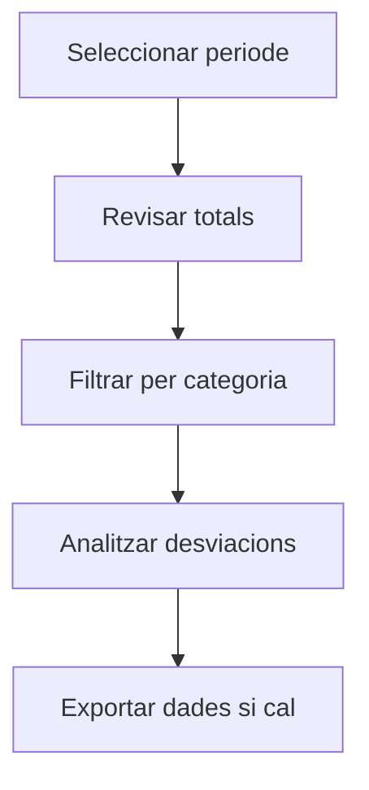

# Factures de compra per període

## Per a que serveix aquesta pantalla

La pantalla de factures per periode permet consultar de forma agregada les factures de compra d'un periode seleccionat. És especialment útil per fer el tancament comptable: pots veure el total d'IVA deduïble, els imports pendents de pagament i els venciments propers.

## Accions disponibles

- Seleccionar el periode comptable
- Aplicar filtres
- Revisar totals d'IVA i imports
- Exportar a full de càlcul

## Flux habitual

1. Selecciona el periode comptable que vols consultar.
2. Revisa els totals agregats per categoria.
3. Filtra per tipus de despesa o proveïdor si cal.
4. Exporta les dades si necessites fer-ne una anàlisi més aprofundida.

## Aspectes importants

- El comportament concret de cada acció depèn de l'estat del cicle de vida de l'entitat.
- Les accions de creació, modificació i eliminació poden estar blocades segons l'estat.
- Alguns camps són de només lectura quan l'entitat ja forma part d'un document comercial vinculat.

## Errors frequents

- Si no es mostren dades, comprova que el filtre estigui ben informat.
- Si l'operació falla, revisa que totes les dades obligatòries estiguin informades.

## Proces basic

