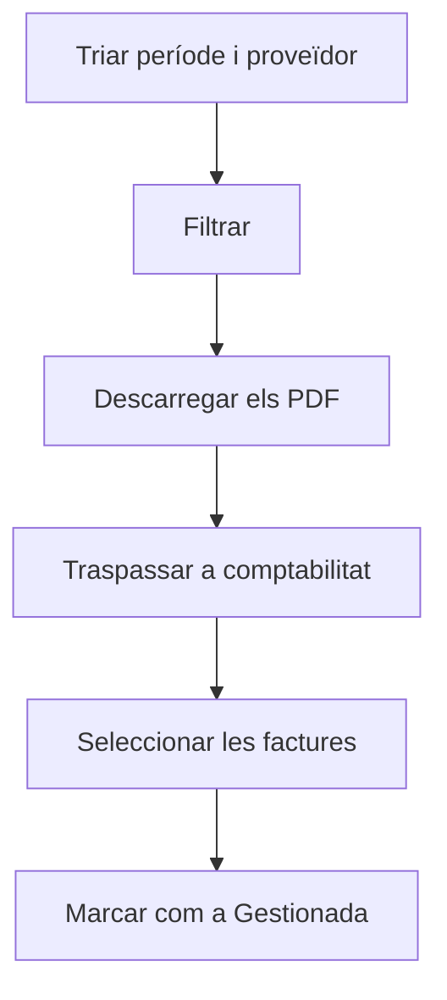

# Comptabilització de factures de compra

## Per a que serveix aquesta pantalla

Serveix per passar a comptabilitat les factures de compra d'un període. Llista les factures que encara no estan gestionades, permet descarregar-ne els documents adjunts i marcar-les com a «Gestionada» de cop quan ja s'han traspassat. És el pas posterior al registre de la factura a «Factures de compra».

## Accions disponibles

- Filtrar per «Període» i «Proveïdor» i aplicar el filtre amb «Filtrar».
- Incloure a la llista les factures ja gestionades marcant «Gestionades».
- Netejar els filtres i buidar la llista amb «Netejar filtres».
- Seleccionar factures amb la casella de cada fila o totes amb la casella de la capçalera.
- Marcar les factures seleccionades com a «Gestionada» amb el botó verd de validació, a la dreta dels filtres.
- Descarregar els documents adjunts d'una factura amb la icona de descàrrega de la fila.

## Flux habitual

1. Obre «Comptabilització de factures de compra». La llista surt buida.
2. Tria el «Període» (per exemple, el mes o el trimestre que vols comptabilitzar) i, si cal, un proveïdor, i prem «Filtrar».
3. Descarrega el PDF de cada factura amb la icona de descàrrega i passa-la al programa de comptabilitat.
4. Selecciona les factures que ja has traspassat.
5. Prem el botó verd de validació: surt «Factures comptabilitzades» amb el nombre de factures, i desapareixen de la llista.

## Aspectes importants

- La llista no es carrega fins que tries un «Període» i filtres. El període filtra per la data de factura.
- Sense marcar «Gestionades», la llista amaga les factures que ja són a l'estat «Gestionada». En marcar o desmarcar la casella, la llista es torna a carregar si hi ha període.
- El botó de validació posa l'estat «Gestionada» a totes les factures seleccionades, sigui quin sigui el seu estat actual. L'estat «Gestionada» ha d'existir al cicle de vida de les factures de compra.
- Aquesta pantalla no desfà la marca: per canviar l'estat d'una factura, obre-la a «Factures de compra».
- La icona de descàrrega baixa tots els fitxers adjunts a la pestanya «Fitxers» de la factura. Si no n'hi ha cap, no es descarrega res.
- La columna «Venciment» mostra l'últim venciment, o la data de factura si no en té. La columna «Import base» és la base imposable.
- Les files no obren la fitxa de la factura.

## Errors frequents

- Si surt «Filtre invàlid» amb «Selecciona un període», tria una data d'inici i una de fi.
- Si el botó de validació està desactivat, selecciona almenys una factura.
- Si una factura no apareix, comprova que la data de factura sigui dins del període i, si ja està gestionada, marca «Gestionades».
- Si en prémer el botó de validació no passa res, comprova a «Cicles de vida» que les factures de compra tinguin un estat anomenat «Gestionada».
- Si la descàrrega no baixa cap fitxer, adjunta el PDF a la pestanya «Fitxers» de la factura.

## Proces basic

```mermaid
flowchart TD
    A[Triar període i proveïdor] --> B[Filtrar]
    B --> C[Descarregar els PDF]
    C --> D[Traspassar a comptabilitat]
    D --> E[Seleccionar les factures]
    E --> F[Marcar com a Gestionada]
```
