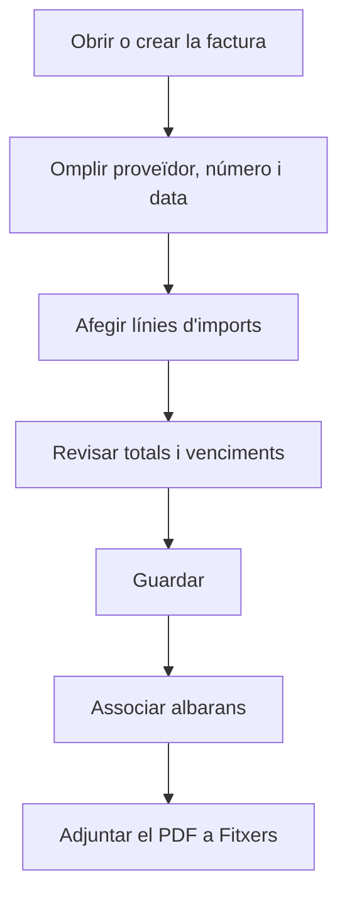

# Factura de compra

## Per a que serveix aquesta pantalla

És la fitxa d'una factura de proveïdor: la capçalera, el desglossament d'imports per tipus d'IVA, els venciments de pagament, els albarans que cobreix i els documents adjunts. Des d'aquí es dona d'alta una factura a mà o es revisa i es modifica una d'existent. És l'últim pas del circuit `comanda de compra -> albarà de recepció -> factura de compra`.

## Accions disponibles

- Omplir la capçalera: «Exercici», «Sèrie», «Estat», «Proveïdor», «Núm. de factura del proveïdor», «Data de factura», «Forma de pagament», «Ports», «% IRPF» i «% descompte».
- Desar la factura amb «Guardar» a la capçalera de la pantalla.
- Afegir línies d'imports a la pestanya «Imports» amb el botó «+», modificar-les fent clic a la fila i eliminar-les amb la creu.
- Consultar els venciments a la pestanya «Venciments».
- Repartir a mà els imports dels venciments amb «Editar venciments», al menú de la fletxa del botó «Guardar».
- Associar albarans pendents de facturar del proveïdor a la pestanya «Albarans» amb el botó «+», i desassociar-los amb la creu.
- Adjuntar o descarregar documents a la pestanya «Fitxers».

## Flux habitual

1. Des de «Factures de compra», prem «+» per crear una factura, o obre'n una des de la llista.
2. Tria el «Proveïdor»: la «Forma de pagament» s'omple amb la del proveïdor.
3. Escriu el «Núm. de factura del proveïdor» i la «Data de factura».
4. A «Imports», afegeix una línia per cada tipus d'IVA amb l'«Import base» i l'«IVA».
5. Completa «Ports», «% IRPF» o «% descompte» si la factura en porta, i comprova el «Total».
6. Prem «Guardar».
7. Torna a obrir la factura per associar-hi els albarans a «Albarans» i adjuntar el PDF a «Fitxers».

## Aspectes importants

- Una factura nova es proposa amb l'exercici de la data de factura, la sèrie «Nacional» i l'estat «Nova». El número intern s'assigna en desar, amb el comptador de l'exercici que correspon a la data de factura, i la factura queda en aquest exercici.
- L'«Estat» només ofereix les transicions permeses des de l'estat actual, definides a «Cicles de vida».
- Els totals es calculen sols: «Base» és la suma de les bases de les línies d'imports; el «Total» és base més ports, més impostos, menys la retenció d'IRPF (calculada sobre base i ports), menys el descompte.
- Cada línia d'imports calcula la quota a partir de l'«Import base» i el percentatge de l'impost; amb un impost d'inversió del subjecte passiu la quota és 0.
- Els venciments es generen a partir de la forma de pagament, la data de factura i el total. Es recalculen cada cop que canvies la data, la forma de pagament, els ports, l'IRPF, el descompte o les línies d'imports, i substitueixen els anteriors, també els repartits a mà.
- «Editar venciments» només surt quan la factura té més d'un venciment. La suma dels imports ha de coincidir amb el total de la factura; els canvis es desen en prémer «Guardar» al peu de la taula.
- En una factura ja desada, les línies d'imports es desen en el moment d'afegir-les, modificar-les o eliminar-les. Els totals de la capçalera es desen amb «Guardar».
- No hi pot haver dues factures del mateix proveïdor amb el mateix «Núm. de factura del proveïdor». La comprovació no s'aplica si el número és «--», que és el valor per defecte d'una factura nova.
- A «Albarans» només s'ofereixen els albarans del proveïdor que encara no estan facturats. Desassociar-ne un el deixa de nou pendent de facturar.
- Després de «Guardar», la pantalla torna a la pantalla anterior.

## Errors frequents

- Si surt «Heu d'introduir els imports de la factura», afegeix almenys una línia a «Imports».
- Si surt «Totes les línies d'IVA han de tenir un impost», obre les línies sense impost i tria'n un.
- Si no es generen venciments, comprova que hi hagi proveïdor, forma de pagament i impost a totes les línies d'imports.
- Si surt «La factura del proveïdor … ja està registrada com a factura …», revisa el número: aquella factura ja existeix.
- Si surt «Exercici invàlid», comprova que hi hagi un exercici actiu que inclogui la data de factura.
- Si surt «La suma (…) no coincideix amb el total de la factura (…)», ajusta els venciments fins que la «Diferència» sigui 0.
- Si no pots associar albarans a una factura nova, desa-la primer i torna-la a obrir.

## Proces basic

