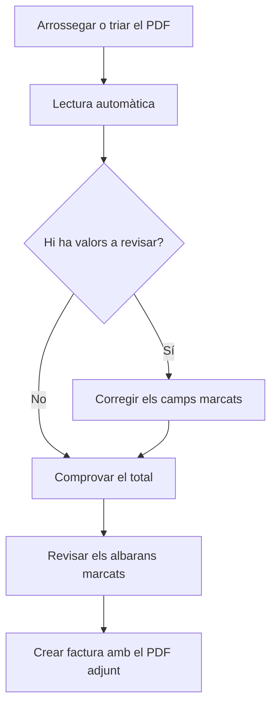

# Importar factura de compra

## Per a que serveix aquesta pantalla

Crea una factura de compra a partir del PDF que ha enviat el proveïdor. El sistema llegeix el PDF, prepara un esborrany de la factura, marca els valors que cal revisar i proposa els albarans pendents que cobreix. No es desa res fins que prems «Crear factura». S'hi arriba des del botó de PDF de «Factures de compra».

## Accions disponibles

- Arrossegar el PDF a la pantalla o triar-lo amb «Selecciona un PDF».
- Consultar el PDF al costat de l'esborrany, amb zoom i pantalla completa.
- Canviar de document amb «Canviar PDF», o tornar a llegir-lo amb «Tornar-ho a provar» si la lectura falla.
- Revisar i corregir la capçalera de la factura (els mateixos camps que a la fitxa de la factura).
- Afegir, modificar i eliminar línies del «Desglossament d'IVA».
- Crear el proveïdor sense sortir de la pantalla amb «Crear proveïdor», quan el NIF de la factura no correspon a cap proveïdor.
- Obrir la factura ja registrada amb «Obrir factura», quan el PDF és un duplicat.
- Marcar o desmarcar els «Albarans pendents de facturar» que cobreix la factura.
- Crear la factura amb «Crear factura», a la capçalera de la pantalla.

## Flux habitual

1. A «Factures de compra», prem el botó de PDF («Importar factura (PDF)»).
2. Arrossega el PDF o prem «Selecciona un PDF», i espera mentre surt «Llegint la factura...». Pot trigar fins a un minut.
3. Revisa la llista de valors a revisar i els camps marcats, comparant-los amb el PDF.
4. Comprova que el «Total calculat» quadri amb el «Total del PDF».
5. Revisa els albarans marcats a «Albarans pendents de facturar» i comprova que «Albarans seleccionats» quadri amb la «Base de la factura».
6. Prem «Crear factura». La factura es crea amb els albarans marcats, s'hi adjunta el PDF i s'obre la seva fitxa.

## Aspectes importants

- S'accepten PDF digitals de fins a 20 MB. El sistema llegeix el NIF i el nom del proveïdor, el número i la data de factura, les bases i les quotes per tipus d'IVA, la retenció d'IRPF, el total i els números d'albarà que apareixen a la factura.
- El proveïdor s'assigna sol si hi ha exactament un proveïdor actiu amb el NIF de la factura, i aleshores la «Forma de pagament» s'omple amb la del proveïdor. Si n'hi ha diversos, cal triar-lo. Si no n'hi ha cap, «Crear proveïdor» obre l'alta amb el nom i el NIF ja omplerts i, en desar-lo, queda assignat a la factura.
- Cada tipus d'IVA es relaciona amb l'impost actiu del mateix percentatge. Si no n'hi ha cap o n'hi ha diversos, la línia queda sense impost, amb el tipus llegit del PDF, i l'has de triar.
- La retenció s'omple al camp «% IRPF». Si el PDF només porta l'import retingut, el percentatge es calcula sobre la base.
- El recàrrec d'equivalència no s'importa: queda marcat perquè l'introdueixis a mà, i el «Total calculat» indica l'import de recàrrec no importat.
- Els «Ports» i el «% descompte» no s'omplen.
- Es marquen per revisar els valors que no s'han pogut llegir, els llegits amb poca fiabilitat, un NIF espanyol no vàlid, una quota que no quadra amb la base i el tipus, i un total que no quadra. Un camp deixa de mostrar l'avís quan el modifiques, i una línia d'IVA quan la deses.
- Els albarans pendents es llisten amb el seu import sense IVA. Es marquen sols els albarans el número dels quals (del proveïdor o intern) apareix a la factura; si no n'hi ha cap, la combinació única d'albarans que suma la base imposable. Si en canvies el proveïdor, la llista es recarrega.
- La factura es crea a l'exercici de la data de factura, amb la sèrie «Nacional» i l'estat «Nova», i el número intern s'assigna en crear-la.
- «Canviar PDF» torna a llegir el document nou i descarta les correccions fetes a l'esborrany.
- Si el servei de lectura no està configurat, la pantalla ho avisa i el botó d'importar no apareix a «Factures de compra».

## Errors frequents

- Si surt «El fitxer ha de ser un PDF» o «El PDF supera els 20 MB», exporta la factura a PDF o redueix-ne la mida i torna-ho a provar.
- Si surt «No s'han pogut llegir les dades de la factura», el PDF pot ser escanejat o estar protegit: introdueix la factura a mà des de «Factures de compra».
- Si surt «El servei de lectura de factures no està disponible», espera una estona i prem «Tornar-ho a provar».
- Si el total calculat no quadra, revisa les bases, les quotes, el «% IRPF» i si la factura porta recàrrec o ports.
- Si surt «Factura duplicada», la factura ja està registrada: obre-la amb «Obrir factura», que s'obre en una pestanya nova.
- Si surt «Totes les línies d'IVA han de tenir un impost», tria l'impost de les línies marcades.
- Si surt «Algun albarà seleccionat no és del proveïdor o ja està facturat», no s'ha creat res: desmarca aquell albarà i torna a crear la factura.
- Si surt «La factura s'ha creat, però no s'ha pogut adjuntar el PDF», adjunta'l des de la pestanya «Fitxers» de la factura.

## Proces basic

