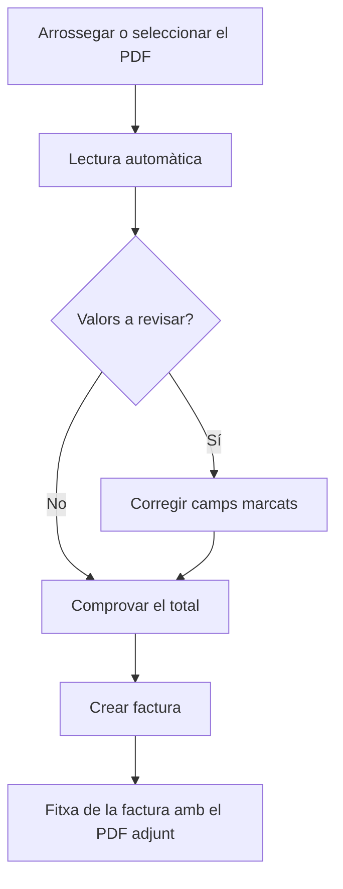

# Importar factura de compra

## Per a que serveix aquesta pantalla

Crea una factura de compra a partir del PDF que t'ha enviat el proveïdor. El sistema llegeix el PDF, omple un esborrany de factura i marca els valors que cal revisar. La factura no es crea fins que l'acceptes.

## Accions disponibles

- Arrossegar el PDF a la pantalla o seleccionar-lo amb el botó
- Veure el PDF al costat de l'esborrany, amb zoom i pantalla completa
- Revisar i corregir les dades de capçalera de la factura
- Afegir, editar i eliminar línies del desglossament d'IVA
- Canviar de PDF i tornar a llegir-lo
- Crear el proveïdor quan el NIF de la factura no correspon a cap proveïdor, sense sortir de la pantalla
- Obrir la factura existent quan el PDF ja està registrat
- Triar els albarans pendents del proveïdor que cobreix la factura
- Crear la factura des del botó de la capçalera

## Flux habitual

1. Arrossega el PDF de la factura o prem "Selecciona un PDF".
2. Espera que el sistema llegeixi la factura. Pot trigar fins a un minut.
3. Revisa la llista de valors a revisar i els camps marcats en groc, comparant-los amb el PDF.
4. Comprova que el total calculat quadri amb el total del PDF.
5. Revisa els albarans suggerits i marca o desmarca els que cobreix la factura.
6. Prem "Crear factura". La factura es crea amb el PDF adjunt i els albarans marcats, i s'obre la seva fitxa.

## Aspectes importants

- Només es llegeixen PDF digitals de fins a 20 MB. Els documents escanejats poden no llegir-se bé.
- El proveïdor s'assigna automàticament si hi ha un únic proveïdor actiu amb el NIF de la factura. Si no n'hi ha cap, "Crear proveïdor" obre l'alta amb el nom i el NIF ja omplerts; en desar-lo queda assignat a la factura.
- No es pot crear una factura amb el mateix proveïdor i el mateix número de factura del proveïdor que una altra. La pantalla ho avisa i enllaça la factura existent.
- Cada tipus d'IVA es relaciona amb l'impost del mateix percentatge. Si no n'hi ha cap, la línia queda sense impost i l'has de triar.
- La retenció d'IRPF s'omple al camp "% IRPF".
- El recàrrec d'equivalència no s'importa: queda marcat perquè l'introdueixis manualment.
- Els ports i els descomptes no s'omplen, perquè a la factura ja formen part de la base imposable.
- Un camp marcat deixa de mostrar l'avís quan el modifiques.
- Es llisten els albarans del proveïdor pendents de facturar amb el seu import sense IVA. Es marquen automàticament els albarans el número dels quals apareix a la factura; si no n'hi ha cap, la combinació d'albarans que suma la base imposable. Si canvies de proveïdor, la llista es recarrega.
- La nova factura es crea a l'exercici actual, la sèrie "Nacional" i l'estat inicial.

## Errors frequents

- "El fitxer ha de ser un PDF": el document no és un PDF. Exporta'l a PDF i torna-ho a provar.
- "No s'han pogut llegir les dades de la factura": el PDF pot ser escanejat o estar protegit. Introdueix la factura manualment.
- "La lectura automàtica de factures no està configurada": cal que l'administrador configuri el servei de lectura.
- El total calculat no quadra: revisa les bases, les quotes i la retenció, i si hi ha recàrrec d'equivalència.
- "Factura duplicada": la factura ja està registrada. Obre-la amb l'enllaç per revisar-la.
- "La factura s'ha creat, però no s'ha pogut adjuntar el PDF": adjunta'l des de la pestanya Fitxers de la factura.

## Proces basic

