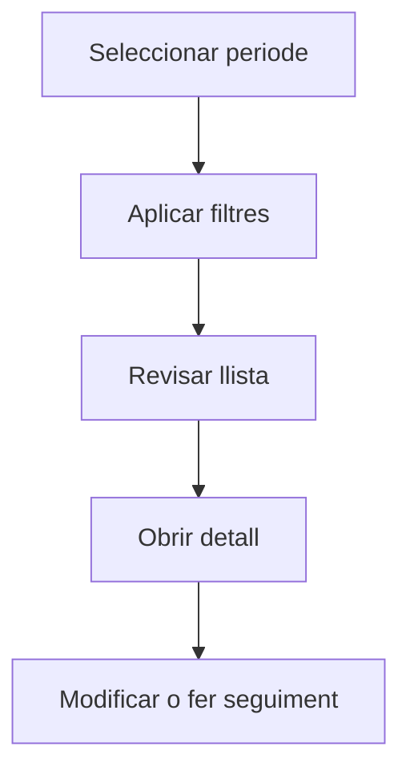

# Factures de compra

## Per a que serveix aquesta pantalla

La pantalla de factures de compra permet consultar les factures rebudes de proveïdors. Pots filtrar per proveïdor, estat, serie, dates o periode comptable, i accedir al detall per revisar-ne el contingut, les dates de venciment i el seu estat.

## Accions disponibles

- Filtrar per proveïdor, estat, sèrie o periode
- Crear una factura manual
- Obrir el detall d'una factura
- Importar factures

## Flux habitual

1. Selecciona el periode o exercici que vols consultar.
2. Aplica els filtres que necessitis per reduir el volum de resultats.
3. Revisa la llista i selecciona l'element que vulguis obrir.
4. Accedeix al detall per fer les modificacions o el seguiment que calgui.

## Aspectes importants

- El comportament concret de cada acció depèn de l'estat del cicle de vida de l'entitat.
- Les accions de creació, modificació i eliminació poden estar blocades segons l'estat.
- Alguns camps són de només lectura quan l'entitat ja forma part d'un document comercial vinculat.

## Errors frequents

- Si no es mostren factures, comprova que el filtre de periode estigui correctament informat.
- Si la importació falla, revisa que el format del fitxer sigui l'esperat.

## Proces basic

