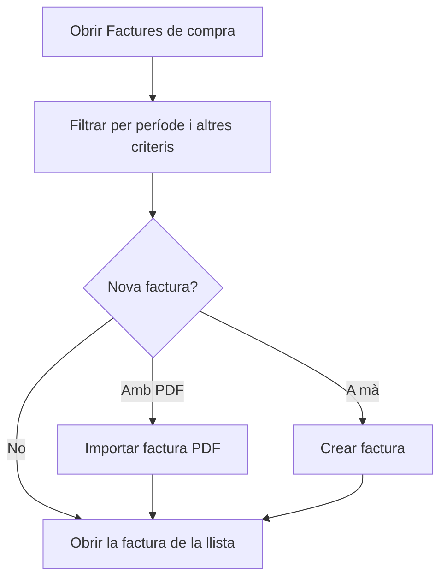

# Factures de compra

## Per a que serveix aquesta pantalla

Llista les factures rebudes dels proveïdors. Serveix per trobar-les per data, proveïdor, forma de pagament, compte bancari o venciment, crear-ne una de nova a mà o a partir del PDF del proveïdor, i obrir-ne la fitxa. La factura tanca el circuit de compra: `comanda de compra -> albarà de recepció -> factura de compra -> venciments`.

## Accions disponibles

- Filtrar per «Període», «Proveïdor», «Mètode de pagament», «Número de compte» i «Venciment», i aplicar el filtre amb «Filtrar».
- Netejar els filtres amb «Netejar filtres»: el període torna a l'any en curs.
- Crear una factura a mà amb el botó «+» («Crear nou»).
- Importar una factura des del PDF del proveïdor amb el botó de PDF («Importar factura (PDF)»).
- Obrir una factura fent clic a la fila.
- Eliminar una factura amb la creu de la fila, només mentre és a l'estat inicial.

## Flux habitual

1. Obre «Factures de compra». Es mostren les factures de l'any en curs o els últims filtres que vas aplicar.
2. Ajusta el «Període» i, si cal, el proveïdor o el venciment, i prem «Filtrar».
3. Revisa el total de la columna «Import» al peu de la taula.
4. Per registrar una factura en PDF, prem el botó de PDF; si l'has d'introduir a mà, prem «+».
5. Fes clic a una fila per revisar-la o modificar-la.

## Aspectes importants

- El «Període» filtra per la data de factura i és obligatori.
- La columna «Venciment» mostra l'últim venciment de la factura, o la data de factura si no en té. El filtre «Venciment» fa servir aquesta mateixa data.
- El filtre «Número de compte» busca pel número de compte bancari del proveïdor.
- La columna «Import» és el total de la factura, i el peu de la taula en mostra la suma.
- La pantalla recorda els últims filtres que has aplicat.
- El botó d'importar des de PDF només apareix quan el servei de lectura de factures està configurat.
- La creu d'eliminar només surt a les factures que són a l'estat inicial del cicle de vida de les factures de compra. L'eliminació és definitiva.

## Errors frequents

- Si surt «Filtre invàlid» amb «Selecciona un període», tria una data d'inici i una de fi al «Període».
- Si no trobes una factura que saps que existeix, revisa que la seva data de factura sigui dins del període i que no tinguis filtres desats de proveïdor, forma de pagament o venciment.
- Si no veus el botó d'importar PDF, el servei de lectura no està configurat; cal que ho revisi l'administrador.
- Si no pots eliminar una factura, comprova que encara sigui a l'estat inicial.

## Proces basic

```mermaid
flowchart TD
    A[Obrir Factures de compra] --> B[Filtrar per període i altres criteris]
    B --> C{Nova factura?}
    C -->|Amb PDF| D[Importar factura PDF]
    C -->|A mà| E[Crear factura]
    C -->|No| F[Obrir la factura de la llista]
    D --> F
    E --> F
```
