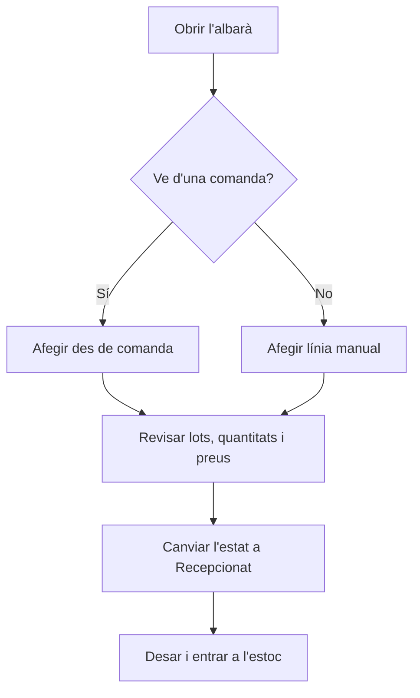

# Albarà de recepció

## Per a que serveix aquesta pantalla

És la fitxa d'un albarà de compra: registra què ha arribat d'un proveïdor, en quina quantitat, amb quines mides i a quin preu. Quan l'albarà passa a l'estat «Recepcionat», el material entra a l'estoc. Les línies poden venir de les comandes de compra pendents del proveïdor, i més endavant l'albarà s'associa a la factura de compra.

## Accions disponibles

- Modificar la capçalera («Exercici», «Data de l'albarà», «Estat», «Proveïdor», «Número d'albarà») i desar-la amb «Desar».
- Afegir línies des de les comandes pendents del proveïdor amb «Afegir des de comanda».
- Afegir una línia manual amb «Afegir línia».
- Modificar una línia fent clic a la fila.
- Eliminar una línia amb la creu de la fila.
- Crear una referència nova des de la pestanya «Referència» del diàleg de la línia.
- Obrir la traçabilitat del lot d'una línia amb la icona d'arbre de la fila.
- Adjuntar o consultar documents a la pestanya «Fitxers».

## Flux habitual

1. Obre l'albarà des de la llista i escriu el «Número d'albarà» que porta el paper del proveïdor.
2. Si el material ve d'una comanda, prem «Afegir des de comanda», marca les línies de comanda rebudes, ajusta la «Quantitat pendent» i l'«Import», i prem «Afegir».
3. Si no hi ha comanda, prem «Afegir línia», tria la «Referència de compra», omple les mides i la «Quantitat», i prem «Crear».
4. Si la referència treballa amb lots, tria o crea el lot a cada línia.
5. Canvia l'«Estat» a «Recepcionat» i prem «Desar» per entrar el material a l'estoc.
6. Adjunta l'albarà escanejat a la pestanya «Fitxers» si cal.

## Aspectes importants

- El «Número» és intern i no es pot modificar. L'«Estat» només ofereix les transicions permeses des de l'estat actual, definides a «Cicles de vida».
- En passar a «Recepcionat» es crea una entrada d'estoc a la ubicació per defecte del magatzem per a cada línia que encara no en tenia. Les línies de referències de servei no generen estoc.
- En treure l'albarà de «Recepcionat» cap a un altre estat, les entrades d'estoc de les seves línies s'eliminen.
- Amb l'albarà a «Recepcionat», «Afegir des de comanda» i «Afegir línia» queden desactivats. Les línies que ja han entrat a l'estoc no mostren la creu d'eliminar.
- En passar a «Recepcionat», si una línia ve d'una comanda lligada a una fase externa d'una ordre de fabricació i aquella línia de comanda ja s'ha rebut sencera, la fase es tanca.
- En afegir línies des de comanda, la quantitat rebuda s'afegeix a la línia de la comanda, que passa a «Rebuda parcialment» o «Rebuda»; quan totes les línies estan rebudes, la comanda passa a «Rebuda». Eliminar la línia de l'albarà resta aquesta quantitat i recalcula els estats.
- Al diàleg «Selecció de comandes», l'«Import» és el preu total del grup i es reparteix entre les línies marcades segons la quantitat. Si el deixes buit, les línies entren amb import 0.
- A la línia manual, el «Format» ve de la referència i decideix quines mides es poden omplir. Per a «RODO», «TUB» i «PLACA» el pes i el preu es calculen a partir de les mides i el «Preu / quilo»; per a «UNITATS», el «Preu» és «Preu unitari» × «Quantitat».
- En triar la referència, el preu es proposa amb el preu d'aquest proveïdor per a la referència o, si no n'hi ha, amb el preu de la referència. La descripció s'omple amb el nom de la referència si era buida.
- Si la referència treballa amb lots i no n'indiques cap, la línia s'assigna a un lot sense codi.
- Cada cop que deses l'albarà, el preu de les línies s'actualitza com a «Últim cost» de la referència i com a preu del proveïdor per a aquesta referència; si el proveïdor no tenia la referència, s'hi afegeix.
- Després de «Desar», la pantalla torna a la pantalla anterior.

## Errors frequents

- Si els botons per afegir línies estan desactivats, l'albarà ja és a «Recepcionat». Si el cicle de vida ho permet, torna'l a l'estat anterior, fes el canvi i torna'l a «Recepcionat».
- Si «Afegir des de comanda» no mostra res, comprova que el proveïdor de l'albarà tingui comandes amb línies pendents de rebre (no rebudes ni cancel·lades).
- Si surt «Selecciona alguna línia per afegir-la a l'albarà» o «No es poden afegir línies amb quantitat 0», marca almenys una línia de comanda i revisa que la «Quantitat pendent» no sigui 0.
- Si la «Calculadora de pes/preu» avisa «Referencia sense format» o «Referencia sense tipus», completa el format i el tipus de la referència a «Referències de compra».
- Si surt «El lot seleccionat no pertany a aquesta referència», tria un lot de la mateixa referència.
- Si surt «La referència i la versió introduïdes ja existeixen» en crear una referència, busca-la al desplegable de la línia.
- Si la «Quantitat» dona error, ha de ser com a mínim 1.

## Proces basic

