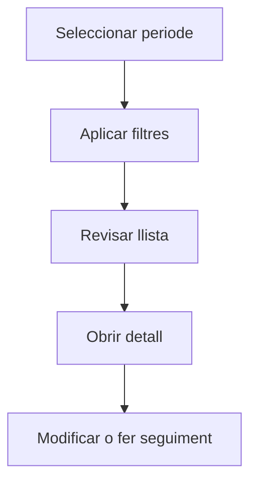

# Recepcions

## Per a que serveix aquesta pantalla

La pantalla de recepcions permet consultar els albarans de recepció de mercaderies en un periode. Pots filtrar per proveïdor, estat o referència, i accedir al detall per revisar les línies rebudes i associar-les a una factura de compra.

## Accions disponibles

- Seleccionar periode
- Filtrar per proveïdor, estat o referència
- Crear una recepció manual
- Obrir el detall d'una recepció

## Flux habitual

1. Selecciona el periode o exercici que vols consultar.
2. Aplica els filtres que necessitis per reduir el volum de resultats.
3. Revisa la llista i selecciona l'element que vulguis obrir.
4. Accedeix al detall per fer les modificacions o el seguiment que calgui.

## Aspectes importants

- El comportament concret de cada acció depèn de l'estat del cicle de vida de l'entitat.
- Les accions de creació, modificació i eliminació poden estar blocades segons l'estat.
- Alguns camps són de només lectura quan l'entitat ja forma part d'un document comercial vinculat.

## Errors frequents

- Si no es mostren recepcions, comprova que el periode estigui seleccionat.
- Si no es pot crear una recepció manual, comprova que tingui una comanda associada.

## Proces basic

