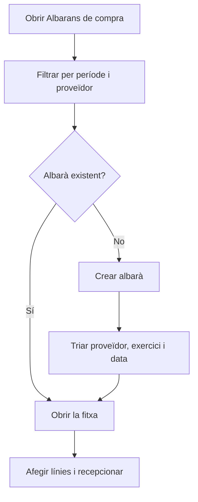

# Albarans de compra

## Per a que serveix aquesta pantalla

Llista els albarans de recepció del material i els serveis que arriben dels proveïdors. Des d'aquí es busquen per període i proveïdor, es crea un albarà nou i s'obre la fitxa per registrar-ne les línies. L'albarà se situa entre la comanda i la factura: `comanda de compra -> albarà de recepció -> estoc -> factura de compra`.

## Accions disponibles

- Filtrar per «Període» i «Proveïdor» i aplicar el filtre amb el botó «Filtrar»; «Netejar filtres» torna a l'any en curs sense proveïdor.
- Crear un albarà amb el botó «+» («Crear nou»): s'obre el diàleg «Crear albarà».
- Obrir un albarà fent clic a la fila.
- Eliminar un albarà amb la creu de la fila, només mentre és a l'estat inicial.

## Flux habitual

1. Obre «Albarans de compra». Per defecte es mostren els albarans de l'any en curs.
2. Si cal, tria un proveïdor al filtre i prem «Filtrar».
3. Per registrar una entrega, prem «+», tria el «Proveïdor», revisa l'«Exercici» i la «Data», i prem «Crear».
4. S'obre la fitxa del nou albarà: afegeix-hi les línies (vegeu l'ajuda de la fitxa).
5. Per consultar-ne un d'existent, fes clic a la fila.

## Aspectes importants

- El «Període» és obligatori: sense un període complet no es fa la cerca.
- La columna «Número» és el número intern, que s'assigna automàticament amb el comptador de l'exercici triat. La columna «Número d'albarà» és el número que figura a l'albarà del proveïdor.
- Un albarà nou es crea amb l'estat inicial del cicle de vida dels albarans, configurat a «Cicles de vida».
- En crear l'albarà, l'«Exercici» es proposa amb l'exercici que porta el nom de l'any en curs.
- La creu d'eliminar només surt als albarans que són a l'estat inicial. L'eliminació és definitiva i esborra també les línies.
- Eliminar tot l'albarà no resta les quantitats rebudes de les comandes. Si l'albarà té línies que venen d'una comanda, elimina primer aquestes línies des de la fitxa: en eliminar una línia, la quantitat rebuda es resta de la comanda.
- El color de l'etiqueta de la columna «Estat» és el de l'estat al cicle de vida.

## Errors frequents

- Si surt «Filtre invàlid» amb «Selecciona un període», tria una data d'inici i una de fi al filtre «Període».
- Si no es pot crear l'albarà perquè l'exercici no existeix o hi ha un error al comptador, revisa que l'exercici triat estigui ben configurat.
- Si en crear surt que el cicle de vida no té un estat inicial, cal definir-lo a «Cicles de vida».
- Si no veus la creu per eliminar un albarà, és perquè ja no és a l'estat inicial.

## Proces basic

```mermaid
flowchart TD
    A[Obrir Albarans de compra] --> B[Filtrar per període i proveïdor]
    B --> C{Albarà existent?}
    C -->|Sí| D[Obrir la fitxa]
    C -->|No| E[Crear albarà]
    E --> F[Triar proveïdor, exercici i data]
    F --> D
    D --> G[Afegir línies i recepcionar]
```
