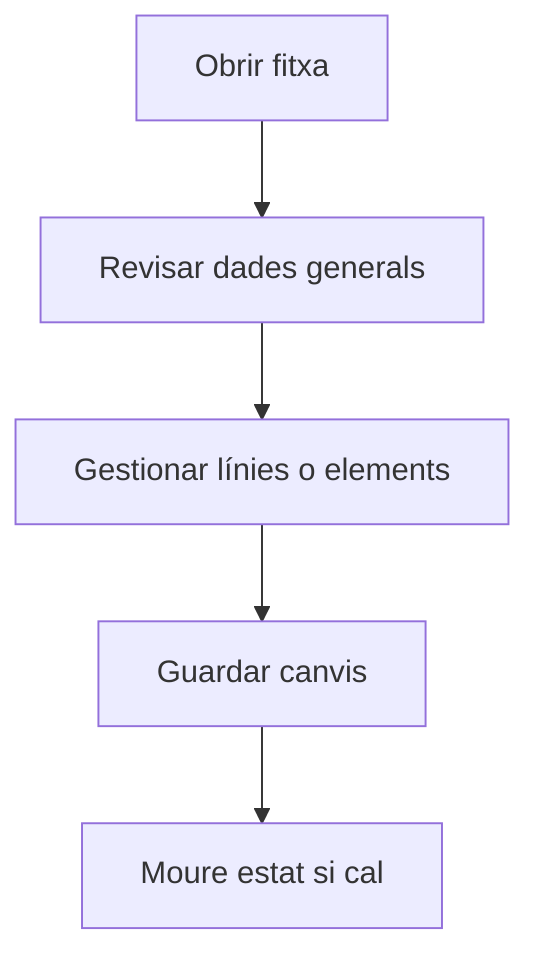

# Proveïdor

## Per a que serveix aquesta pantalla

Pantalla de gestió de l'entitat.

## Accions disponibles

- Guardar els canvis de la fitxa
- Afegir i editar contactes
- Afegir adreces de lliurament i facturació
- Gestionar tarifes de compra
- Gestionar descomptes per article
- Seleccionar el tipus de proveïdor

## Flux habitual

1. Revisa les dades generals de la fitxa.
2. Gestiona les línies o els elements associats segons calgui.
3. Guarda els canvis quan hagueu acabat.
4. Si la fitxa té un cicle de vida, mou l'estat segons correspongui.

## Aspectes importants

- El comportament concret de cada acció depèn de l'estat del cicle de vida de l'entitat.
- Les accions de creació, modificació i eliminació poden estar blocades segons l'estat.
- Alguns camps són de només lectura quan l'entitat ja forma part d'un document comercial vinculat.

## Errors frequents

- Si no es pot desar la fitxa, comprova que el NIF no estigui duplicat a un altre proveïdor.
- Si les tarifes no es carreguen, revisa la connexió amb el servei de preus.

## Proces basic

