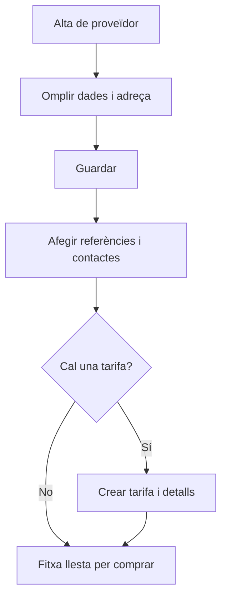

# Proveïdor

## Per a que serveix aquesta pantalla

És la fitxa d'un proveïdor: dades fiscals i de contacte, adreça, forma de pagament i les condicions de compra. Les referències i tarifes que hi defineixes s'aprofiten després en crear comandes de compra (preu, descripció i data prevista de cada línia) i en calcular serveis externs i transports als pressupostos i comandes de venda. La llista i els tipus de proveïdor es gestionen a la pantalla «Proveïdors».

## Accions disponibles

- Omplir o modificar les dades a la pestanya «Proveïdor» i desar-les amb «Guardar», a la capçalera de la pantalla.
- Cercar l'adreça amb «Cerca ubicació» per omplir automàticament els camps de l'adreça i les coordenades.
- Consultar les coordenades i la distància a l'apartat plegable «Coordenades i distància», i obrir-les amb «Veure al mapa».
- Afegir, editar o eliminar a la pestanya «Referències» les referències de compra que ven aquest proveïdor, amb el seu codi, descripció, preu i dies de subministrament.
- Afegir, editar o eliminar persones de contacte a la pestanya «Contactes».
- Crear, editar, duplicar o eliminar tarifes a la pestanya «Tarifes de compra», i definir-ne els detalls per referència.
- Crear i mantenir tarifes de transport a la pestanya «Tarifes de transport» (només per a proveïdors de tipus «Logistica»).

## Flux habitual

1. Des de «Proveïdors», prem «+» per obrir la pantalla «Alta de proveïdor».
2. Omple «Nom comercial», «Nom fiscal», «NIF/CIF» i «Tipus de proveïdor».
3. Tria el «País» i fes servir «Cerca ubicació» per omplir l'adreça; revisa «Direcció», «Ciutat», «Província» i «Codi postal».
4. Omple «Telèfon», «Forma de pagament» i «Número de compte», i prem «Guardar».
5. Un cop creat, apareixen les altres pestanyes: afegeix a «Referències» el que compres a aquest proveïdor i a «Contactes» les persones de referència.
6. Si cal, crea a «Tarifes de compra» una tarifa amb les seves dates i afegeix-hi els detalls.

## Aspectes importants

- Les pestanyes «Referències», «Contactes» i «Tarifes de compra» només apareixen després de desar el proveïdor per primer cop.
- Són obligatoris: «Nom comercial», «Nom fiscal», «NIF/CIF» (fins a 15 caràcters), «Tipus de proveïdor», «Direcció», «Ciutat», «Província», «Codi postal», «Telèfon», «Forma de pagament» i «Número de compte» (fins a 35 caràcters).
- No pot haver-hi dos proveïdors amb el mateix nom comercial.
- «Cerca ubicació» només s'activa després de triar el «País».
- En desar, si no hi ha coordenades, l'aplicació intenta obtenir-les a partir de l'adreça, i calcula la «Distància des de la seu (km)». Aquest camp no es pot editar.
- A «Referències», «Preu del proveïdor» i «Dies de subministrament» són els valors que es proposen en afegir aquesta referència a una comanda de compra del proveïdor: el preu, la descripció i la data prevista (avui més els dies de subministrament). Una mateixa referència només es pot afegir una vegada per proveïdor.
- Quan es desa un albarà de recepció d'aquest proveïdor, el «Preu del proveïdor» de cada referència s'actualitza amb el preu de l'albarà; si la referència encara no hi era, s'hi afegeix automàticament.
- A «Tarifes de compra», fes clic a una tarifa per veure'n els «Detalls» a la taula inferior. El botó «+» dels detalls només s'activa amb una tarifa seleccionada. Cada detall indica la «Referència», el «Tipus de càlcul» («Unitats», «Volum» o «Pes»), el tram «Des de» i «Fins a» i el «Preu (€)».
- La tarifa de compra vigent en una data decideix si els serveis externs d'aquest proveïdor es calculen per unitats, volum o pes als pressupostos i comandes de venda.
- Les tarifes de compra d'un mateix proveïdor no es poden encavalcar en dates. «Duplicar» crea una tarifa nova amb el nom i les dates que indiquis i en copia tots els detalls.
- La pestanya «Tarifes de transport» només es mostra si el tipus del proveïdor es diu exactament «Logistica». Cada tarifa té dates de validesa i detalls per trams de pes, volum i distància amb el seu preu.
- «Notes per a les comandes de compra» és un camp de text separat de les «Observacions» generals.

## Errors frequents

- Si en crear el proveïdor surt «Proveïdor ... existent», ja hi ha un proveïdor amb aquest nom comercial: cerca'l a la llista.
- Si el formulari no es desa, revisa els missatges sota els camps obligatoris, sobretot l'adreça, la forma de pagament i el número de compte.
- Si no pots escriure a «Cerca ubicació», tria primer el «País».
- Si en afegir una referència surt «La referència ja existeix», aquesta referència ja està vinculada al proveïdor: edita la fila existent.
- Si no pots desar o duplicar una tarifa de compra, revisa que les dates no es trepitgin amb una altra tarifa del mateix proveïdor i que la data de fi no sigui anterior a la d'inici.
- Si no veus la pestanya «Tarifes de transport», comprova que el tipus del proveïdor sigui «Logistica».

## Proces basic

```mermaid
flowchart TD
    A[Alta de proveïdor] --> B[Omplir dades i adreça]
    B --> C[Guardar]
    C --> D[Afegir referències i contactes]
    D --> E{Cal una tarifa?}
    E -->|Sí| F[Crear tarifa i detalls]
    E -->|No| G[Fitxa llesta per comprar]
    F --> G
```
