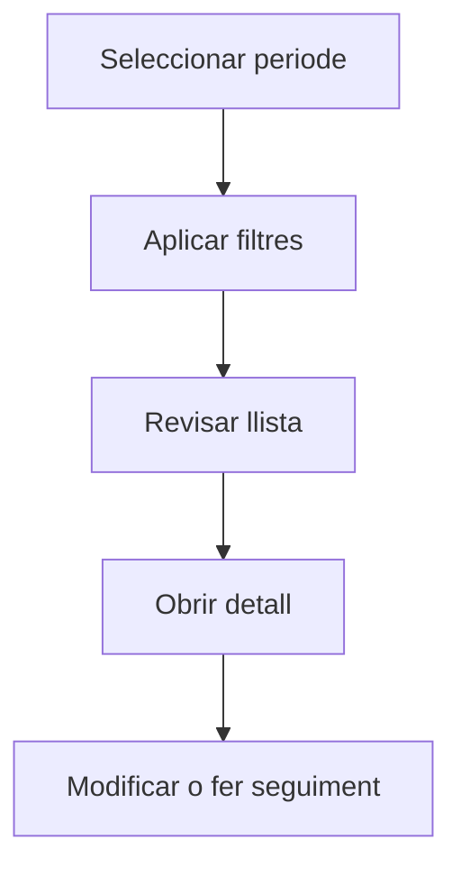

# Proveïdors

## Per a que serveix aquesta pantalla

La pantalla de proveïdors permet consultar el directori de proveïdors actius. Pots filtrar per tipus de proveïdor, cercar per nom o NIF, i accedir a la fitxa de cada proveïdor per gestionar contactes, adreces, condicions comercials i tarifes.

## Accions disponibles

- Filtrar per tipus de proveïdor
- Cercar per nom o NIF
- Crear un proveïdor nou
- Obrir el detall d'un proveïdor
- Eliminar un proveïdor

## Flux habitual

1. Selecciona el periode o exercici que vols consultar.
2. Aplica els filtres que necessitis per reduir el volum de resultats.
3. Revisa la llista i selecciona l'element que vulguis obrir.
4. Accedeix al detall per fer les modificacions o el seguiment que calgui.

## Aspectes importants

- El comportament concret de cada acció depèn de l'estat del cicle de vida de l'entitat.
- Les accions de creació, modificació i eliminació poden estar blocades segons l'estat.
- Alguns camps són de només lectura quan l'entitat ja forma part d'un document comercial vinculat.

## Errors frequents

- Si no es mostren proveïdors, comprova que el filtre de tipus no estigui buit.
- Si no es pot eliminar un proveïdor, revisa si té comandes, rebuts o factures associades.

## Proces basic

