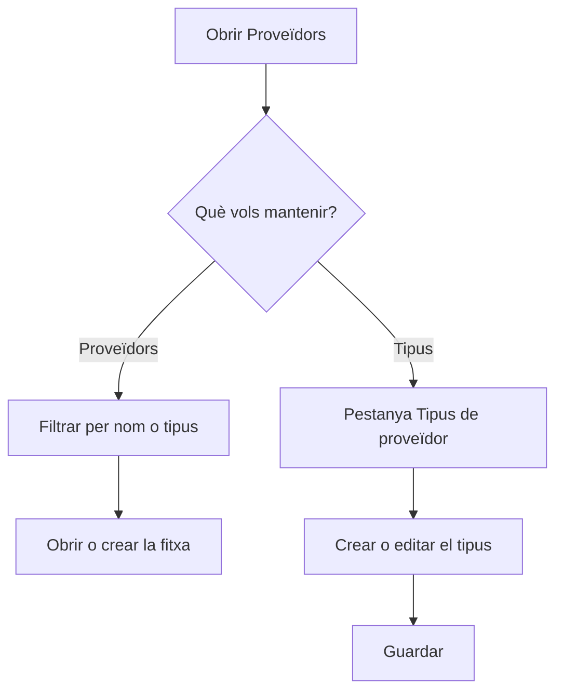

# Proveïdors

## Per a que serveix aquesta pantalla

És el directori de proveïdors de l'empresa i, a la mateixa pantalla, el catàleg de tipus de proveïdor. Des d'aquí localitzes un proveïdor per obrir-ne la fitxa, en dones d'alta un de nou o mantens la classificació per tipus. El proveïdor és la base de tot el circuit de compres: comanda de compra -> albarà de recepció -> factura de compra.

## Accions disponibles

- Cercar proveïdors amb els filtres «Nom» (busca dins del nom comercial) i «Tipus». La llista es filtra a mesura que escrius o tries.
- Obrir la fitxa d'un proveïdor fent clic a la fila.
- Crear un proveïdor amb el botó «+» («Crear nou») de la pestanya «Proveïdors».
- Eliminar un proveïdor amb la «X» de la fila, després de confirmar-ho.
- Canviar a la pestanya «Tipus de proveïdor» per veure el catàleg de tipus.
- Crear un tipus amb el botó «+» d'aquesta pestanya, o editar-lo fent clic a la fila: s'obre un diàleg amb «Nom» i «Descripció» i el botó «Guardar».
- Eliminar un tipus de proveïdor amb la «X» de la fila, després de confirmar-ho.

## Flux habitual

1. Obre la pantalla «Proveïdors».
2. Escriu part del nom comercial a «Nom» o tria un «Tipus» per reduir la llista.
3. Fes clic a la fila per obrir la fitxa del proveïdor.
4. Si no existeix, prem «+» i omple la fitxa del proveïdor nou.
5. Si falta una classificació, ves a «Tipus de proveïdor», prem «+», omple «Nom» i «Descripció» i prem «Guardar».

## Aspectes importants

- El botó «+» crea un proveïdor o un tipus de proveïdor segons la pestanya activa.
- La llista mostra «Nom comercial», «Nom fiscal», el CIF, «Telèfon» i «Tipus».
- Cada proveïdor ha de tenir un tipus: el camp «Tipus de proveïdor» de la fitxa és obligatori. Crea els tipus abans de donar d'alta proveïdors.
- El tipus anomenat exactament «Logistica» té un ús especial: els proveïdors d'aquest tipus mostren la pestanya «Tarifes de transport» a la seva fitxa i són els que es poden triar com a transportistes als pressupostos i a les comandes de venda. No canviïs el nom d'aquest tipus.
- Al diàleg de tipus, «Nom» i «Descripció» són obligatoris i admeten fins a 250 caràcters.
- Eliminar un proveïdor o un tipus és definitiu, i l'aplicació no ho permet si ja s'han fet servir: un proveïdor amb comandes, albarans, factures, tarifes o serveis externs, o un tipus amb proveïdors assignats, no s'elimina i surt un avís. Si un tipus té proveïdors, canvia'ls primer de tipus.

## Errors frequents

- Si surt «No s'ha pogut eliminar el proveïdor ...» o «No s'ha pogut eliminar el tipus de proveïdor ...», el proveïdor ja s'ha fet servir i s'ha de conservar, o el tipus té proveïdors que cal canviar primer de tipus.
- Si no trobes un proveïdor, comprova que el filtre «Tipus» estigui buit i que busques pel nom comercial, no pel nom fiscal.
- Si en crear un tipus surt «L'entitat ja existeix», ja hi ha un tipus amb aquest nom.
- Si el diàleg de tipus no es desa, revisa que «Nom» i «Descripció» estiguin informats.
- Si un proveïdor de transport no surt als pressupostos o a les comandes de venda, comprova que el seu tipus sigui «Logistica».
- Si el botó «+» obre una pantalla que no esperaves, revisa quina pestanya tens activa.

## Proces basic

```mermaid
flowchart TD
    A[Obrir Proveïdors] --> B{Què vols mantenir?}
    B -->|Proveïdors| C[Filtrar per nom o tipus]
    C --> D[Obrir o crear la fitxa]
    B -->|Tipus| E[Pestanya Tipus de proveïdor]
    E --> F[Crear o editar el tipus]
    F --> G[Guardar]
```
