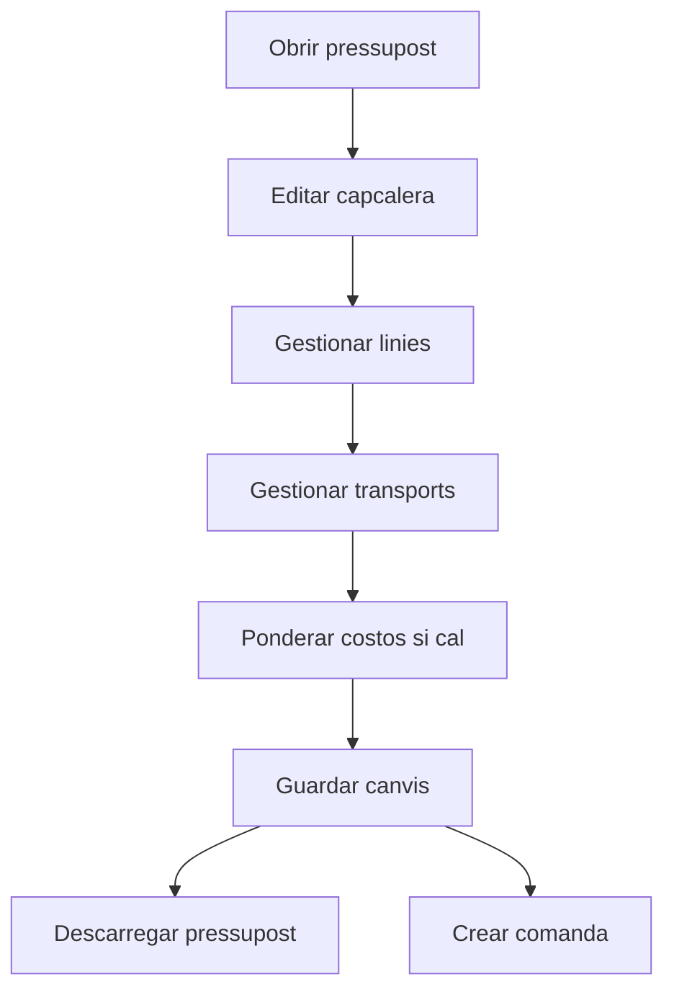

# Pressupost

## Per a que serveix aquesta pantalla

La fitxa de pressupost serveix per mantenir la capcalera comercial, les linies valorades, els transports associats i les notes internes. Des d'aqui tambe pots descarregar el document i generar la comanda de venda quan el pressupost ja esta validat.

## Accions disponibles

- Guardar els canvis de la capcalera.
- Descarregar el pressupost en format document.
- Crear una comanda a partir del pressupost.
- Afegir, editar i eliminar linies del pressupost.
- Afegir, editar i eliminar transports.
- Ponderar els costos de transport entre les linies.
- Informar notes internes i consultar les notes automatiques.

## Flux habitual

1. Revisa les dades generals del pressupost i desa els canvis si cal.
2. Completa o ajusta les linies del detall.
3. Informa els transports si formen part del calcul economic.
4. Si cal, reparteix els costos de transport entre les linies.
5. Revisa les notes internes.
6. Quan el pressupost sigui correcte, descarrega'l o crea la comanda associada.

## Aspectes importants

- Si el pressupost ja te una comanda associada, el flux comercial habitual considera el pressupost tancat i diverses accions de modificacio deixen d'estar disponibles.
- La creacio de la comanda es fa des del boto d'accions i, si tot va be, el sistema obre directament la comanda generada.
- La ponderacio de costos reparteix el cost de transport entre els detalls del pressupost. Es especialment util quan el marge depen del cost logistic real.
- Les notes internes son d'us intern; les notes automatiques son informatives i es mostren en mode de consulta.

## Errors frequents

- Si no pots guardar, revisa que la data del pressupost estigui informada.
- Si no es pot crear la comanda, comprova si ja n'hi ha una d'associada o si el servidor retorna algun error funcional.
- Si la ponderacio falla, revisa si el pes total de les linies o dels transports es zero.
- Si una linia o un transport no es reflecteix correctament, torna a obrir el dialeg o recarrega la pantalla.

## Proces basic

