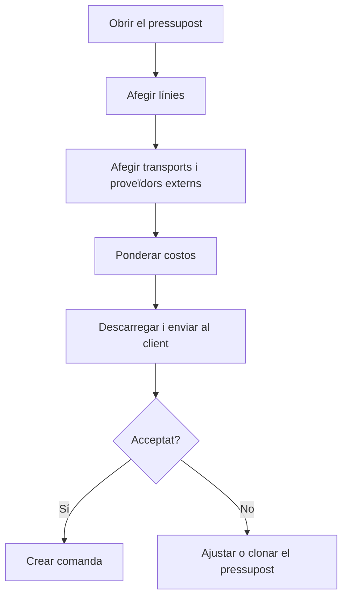

# Pressupost

## Per a que serveix aquesta pantalla

És la fitxa d'un pressupost de venda. Hi prepares l'oferta per al client: les línies amb referència, costos, marges i preu, els transports i els serveis externs. Quan el client l'accepta, des d'aquí generes la comanda (pressupost -> comanda -> albarà -> factura) i descarregues el document per enviar-lo.

## Accions disponibles

- Modificar la capçalera («Data Alta», «Data Acceptació», «Estat», «Client», «Dies naturals entrega», «Notes internes») i desar-la amb «Guardar».
- Obrir el menú de la fletxa de «Guardar» per a:
  - «Descarregar»: genera el pressupost en format Word.
  - «Imprimir PDF»: genera el pressupost en PDF.
  - «Crear comanda»: genera la comanda de venda a partir del pressupost.
  - «Clonar pressupost»: crea un pressupost nou amb les mateixes línies.
- Obrir la fitxa del client amb la lupa del camp «Client».
- Pestanya «Detall»: afegir línies amb «Afegir línia», editar-les fent clic a la fila, eliminar-les amb la «X» i repartir costos amb «Ponderar costos».
- Pestanya «Transport»: afegir transports amb «Afegir transport», editar-los i eliminar-los.
- Pestanya «Serveis externs»: triar el «Proveïdor» de cada servei extern.

## Flux habitual

1. Revisa el «Client» i els «Dies naturals entrega».
2. A «Detall», prem «Afegir línia», tria la «Referència» i, si en té, la «Ruta de fabricació»; ajusta «Quantitat», marges i «Descompte», i prem «Guardar».
3. Si hi ha serveis externs, tria'n el «Proveïdor» a «Serveis externs».
4. Si l'enviament es cobra, afegeix-lo a «Transport» amb el transportista i la tarifa.
5. Prem «Ponderar costos» perquè el transport i els serveis externs es reparteixin entre les línies.
6. Descarrega el document amb «Descarregar» o «Imprimir PDF» i envia'l al client.
7. Quan l'accepti, tria «Crear comanda»: s'obre la comanda nova.

## Aspectes importants

- «Pressupost» (el número) i «Comanda» són de només lectura. «Comanda» mostra el número de la comanda creada des d'aquest pressupost.
- El desplegable «Estat» només ofereix els canvis d'estat permesos des de l'estat actual, definits a «Cicles de vida».
- En passar de «Pendent d'acceptar» a «Acceptat», la «Data Acceptació» s'omple amb la data del moment.
- «Guardar» desa la capçalera i torna a la pantalla anterior. Les línies, els transports i els serveis externs es desen en el moment, cadascun des del seu diàleg.
- «Crear comanda» crea una comanda amb data d'avui, a l'exercici de la data actual i amb data prevista d'avui més els «Dies naturals entrega». Hi copia les línies, els transports i els serveis externs, i posa el pressupost a «Acceptat» amb la data d'acceptació d'avui. Utilitza el client i els dies d'entrega que hi ha a la pantalla, encara que no els hagis desat.
- Un pressupost només pot tenir una comanda. Un cop creada, desapareixen «Afegir línia», «Ponderar costos», «Afegir transport» i les icones per eliminar línies i transports.
- A la línia, la «Referència» mostra les referències del client del pressupost i les que no tenen client. Si la referència té una sola ruta de fabricació activa, es tria automàticament i se'n calculen els costos de producció, material, servei i transport per a la quantitat indicada.
- «Benefici» i «Total» es calculen sols a partir dels costos, els percentatges de benefici i el «Descompte». El «Preu unitari» es pot ajustar a mà.
- La pestanya «Marges» de la línia mostra el benefici per fase de la ruta. «Aplicar» copia el «Benefici ponderat» al «% Benefici Producció».
- En desar una línia amb ruta, el sistema suma el seu pes al pressupost i afegeix a «Serveis externs» els serveis de les fases externes de la ruta.
- A «Serveis externs», en triar el proveïdor, el preu es calcula amb la seva tarifa (per volum, pes o unitats) i es desa automàticament.
- Al transport, «Enviament a client final» agafa la distància de l'adreça principal del client. La «Tarifa de Transport» només ofereix tarifes vigents del transportista compatibles amb el pes, el volum i la distància, ordenades de més barata a més cara i amb la més barata marcada com a «Millor preu».
- «Ponderar costos» reparteix el cost de transport entre les línies segons el pes de cada una, reparteix els serveis externs segons la tarifa vigent del proveïdor a la data del pressupost i recalcula el cost, el preu unitari i el total de cada línia. Si havies ajustat preus a mà, revisa'ls després.
- «Clonar pressupost» crea un pressupost amb número nou, data d'avui i estat inicial, amb el mateix client, línies, transports i serveis externs, i l'obre.
- Les «Notes automàtiques» són de només lectura; hi apareix, per exemple, l'avís de rebuig automàtic d'un pressupost pendent massa antic.
- «Descarregar» i «Imprimir PDF» generen el document en l'idioma configurat a la fitxa del client.

## Errors frequents

- Si «Crear comanda» avisa «Aquest document ja té un document associat», el pressupost ja té comanda: la trobaràs al camp «Comanda».
- Si «Crear comanda» falla amb «El client no és vàlid per a crear una factura...» o «El client no té direccions donades d'alta...», completa «Nom fiscal», «NIF/CIF», «Número de compte» i l'adreça a la fitxa del client.
- Si falla amb «No s'ha trobat cap exercici per a la data actual», cal crear l'exercici de l'any a «Exercicis».
- Si falla perquè la seu no és vàlida per crear una factura, revisa les dades de facturació del centre de l'empresa (adreça, ciutat, codi postal, província, país i NIF).
- Si «Ponderar costos» retorna «No s'han pogut ponderar els costos.», comprova que el pressupost tingui línies.
- Si una línia no rep cost de transport en ponderar, probablement no té pes: el pes només es calcula per a línies amb ruta de fabricació i referència amb tipus de material.
- Si no pots triar una «Tarifa de Transport», tria primer el transportista i comprova que tingui tarifes vigents per al pes, el volum i la distància.
- Si la línia no es desa, revisa que la «Quantitat» sigui 1 o més.

## Proces basic

```mermaid
flowchart TD
    A[Obrir el pressupost] --> B[Afegir línies]
    B --> C[Afegir transports i proveïdors externs]
    C --> D[Ponderar costos]
    D --> E[Descarregar i enviar al client]
    E --> F{Acceptat?}
    F -->|Sí| G[Crear comanda]
    F -->|No| H[Ajustar o clonar el pressupost]
```
