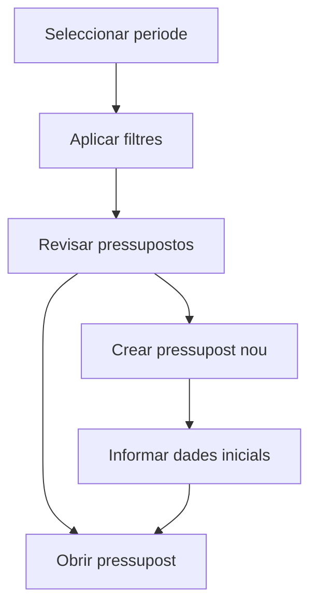

# Pressupostos

## Per a que serveix aquesta pantalla

La pantalla de pressupostos permet consultar els pressupostos comercials d'un periode, filtrar-los per client i estat, i iniciar la creacio d'un pressupost nou. Es el punt habitual d'entrada del flux comercial abans de generar una comanda.

## Accions disponibles

- Seleccionar un periode de treball amb l'exercici actiu.
- Filtrar per client.
- Filtrar per estat del pressupost.
- Netejar els filtres i tornar al periode actual.
- Crear un pressupost nou.
- Obrir la fitxa d'un pressupost existent.
- Eliminar un pressupost si encara es troba en l'estat inicial.

## Flux habitual

1. Selecciona el periode que vols revisar.
2. Aplica filtres per client o estat si vols reduir el volum de resultats.
3. Prem el boto de filtre per carregar la llista.
4. Revisa la taula i obre el pressupost que necessitis.
5. Si has de crear-ne un de nou, prem el boto `+`, informa client, exercici i data, i continua a la fitxa de detall.

## Aspectes importants

- La creacio del pressupost no es fa directament dins la fitxa. Primer s'obre un dialeg inicial amb les dades basiques i despres el sistema navega al detall.
- La pantalla desa els filtres de l'usuari mentre navegues, de manera que en tornar acostumes a recuperar el mateix context de treball.
- La icona d'eliminar nomes apareix quan el pressupost es troba a l'estat inicial del seu cicle de vida.
- Si un pressupost ja te una comanda associada, no es pot eliminar.

## Errors frequents

- Si no es mostren dades, comprova que hi hagi un periode seleccionat.
- Si el pressupost no es pot eliminar, revisa si ja te una comanda associada.
- Si els filtres no donen el resultat esperat, neteja'ls i torna a aplicar-los.
- Si la creacio falla, revisa que el client, l'exercici i la data estiguin informats correctament al dialeg inicial.

## Proces basic

