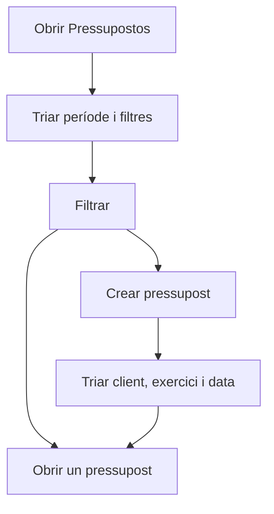

# Pressupostos

## Per a que serveix aquesta pantalla

Mostra els pressupostos de venda d'un període i és on se'n creen de nous. El pressupost és el primer pas del flux comercial (pressupost -> comanda -> albarà -> factura): quan el client l'accepta, des de la fitxa del pressupost se'n genera la comanda.

## Accions disponibles

- Triar el «Període» per data del pressupost; per defecte és l'any en curs.
- Filtrar per «Client» i per un o més valors d'«Estat».
- Aplicar els filtres amb «Filtrar».
- Tornar als filtres inicials amb «Netejar»: esborra client i estats i torna a posar l'any en curs.
- Crear un pressupost amb el botó «+» («Crear nou»), que obre el diàleg «Crear pressupost».
- Obrir un pressupost fent clic a la fila.
- Eliminar un pressupost amb la icona de paperera («Eliminar»), només visible en els pressupostos que són a l'estat inicial.
- Adaptar les columnes i desar vistes amb la icona d'engranatge («Configuració de la vista»).

## Flux habitual

1. Obre «Pressupostos»: es carreguen els de l'any en curs.
2. Si cal, canvia el «Període», tria un «Client» o uns estats i prem «Filtrar».
3. Revisa «Número», «Data», «Client», «Estat», «Data d'acceptació» i «Dies d'entrega».
4. Per crear-ne un, prem «+», tria «Client», «Exercici» i «Data», i prem «Guardar».
5. El sistema crea el pressupost i n'obre la fitxa per afegir-hi les línies.

## Aspectes importants

- El «Període» és obligatori: sense una data d'inici i una de final, la llista no es carrega.
- El número del pressupost l'assigna el sistema a partir del comptador de pressupostos de l'exercici triat. Els exercicis es gestionen a «Exercicis».
- Al diàleg de creació, l'«Exercici» proposat és el que porta el nom de l'any actual.
- Tot pressupost nou entra a l'estat inicial del cicle de vida de pressupostos, configurat a «Cicles de vida».
- Els pressupostos que continuen a l'estat «Pendent d'acceptar» 30 dies després de la seva data passen automàticament a «Rebutjat», amb una nota automàtica que ho indica.
- Només es pot eliminar un pressupost a l'estat inicial i sense comanda associada. L'eliminació és definitiva.
- Els filtres i les columnes es guarden a la teva vista de la taula, de manera que en tornar a la pantalla recuperes el context de treball.

## Errors frequents

- Si surt «Filtre invàlid» o «Selecciona un període», tria una data d'inici i una de final al «Període».
- Si no veus la paperera en un pressupost, és perquè ja no és a l'estat inicial.
- Si en eliminar surt «No es pot eliminar» amb «El pressupost té la comanda ... associada», el pressupost ja s'ha convertit en comanda i s'ha de conservar.
- Si la creació falla amb «Error al crear el comptador» o «El cicle de vida 'Budget' no té un estat inicial», revisa l'exercici a «Exercicis» o l'estat inicial a «Cicles de vida».
- Si «Guardar» no fa res al diàleg, revisa que «Client», «Exercici» i «Data» estiguin informats.

## Proces basic

```mermaid
flowchart TD
    A[Obrir Pressupostos] --> B[Triar període i filtres]
    B --> C[Filtrar]
    C --> D[Obrir un pressupost]
    C --> E[Crear pressupost]
    E --> F[Triar client, exercici i data]
    F --> D
```
