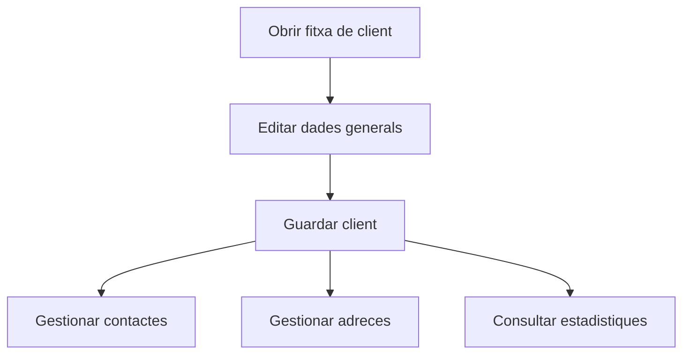

# Fitxa de client

## Per a que serveix aquesta pantalla

La fitxa de client serveix per mantenir les dades comercials i fiscals del client, aixi com els seus contactes, adreces i un resum d'activitat comercial. Es la pantalla central per consolidar tota la informacio operativa del client.

## Accions disponibles

- Crear o editar les dades generals del client.
- Guardar els canvis de la fitxa.
- Afegir, modificar i eliminar contactes.
- Afegir, modificar i eliminar adreces.
- Consultar les estadistiques del client.

## Flux habitual

1. Revisa o completa les dades generals del client.
2. Desa la fitxa si es tracta d'un client nou.
3. Gestiona contactes i adreces a les pestanyes corresponents.
4. Consulta les estadistiques per obtenir context comercial del client.

## Aspectes importants

- Quan s'entra amb un identificador nou, la pantalla funciona en mode alta fins que es desa el client.
- Les pestanyes de contactes, adreces i estadistiques tenen sentit un cop el client ja existeix com a registre guardat.
- Aquesta fitxa concentra informacio comercial, fiscal i de relacio, per tant convé revisar amb atencio els camps clau abans de desar.
- Les estadistiques ofereixen context comercial, pero no substitueixen l'analisi detallada de tots els documents historics.

## Errors frequents

- Si un client nou no es desa, revisa els camps obligatoris de la capcalera.
- Si no apareixen contactes o adreces, comprova que el client s'hagi creat correctament.
- Si les estadistiques no es carreguen, valida que existeixin dades comercials relacionades.
- Si una dada sembla desactualitzada, torna a obrir la fitxa per refrescar el context.

## Proces basic

