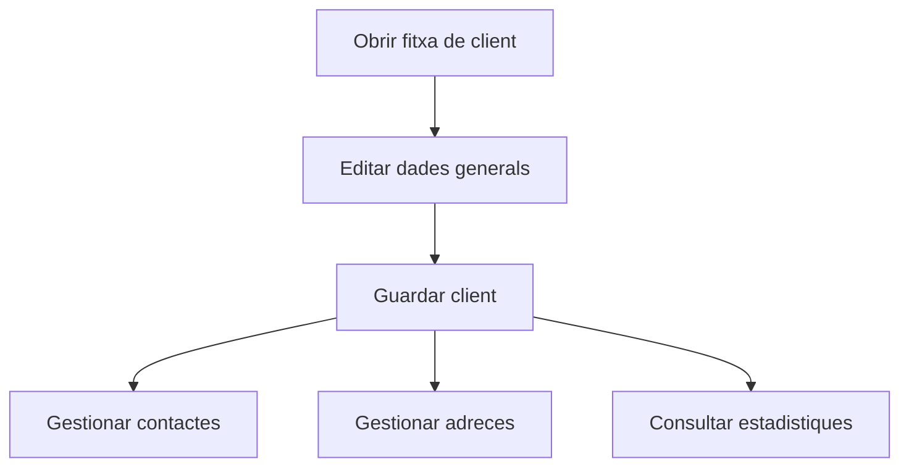

# Fitxa de client

## Per a que serveix aquesta pantalla

La fitxa de client serveix per mantenir les dades comercials i fiscals del client, aixi com els seus contactes, adreces i un resum d'activitat.

## Accions disponibles

- Editar les dades generals del client.
- Afegir, modificar i eliminar contactes.
- Afegir, modificar i eliminar adreces.
- Consultar estadistiques del client.
- Guardar els canvis fets a la fitxa.

## Flux habitual

1. Revisa o completa les dades generals.
2. Desa la fitxa si has creat un client nou.
3. Gestiona contactes i adreces a les pestanyes corresponents.
4. Consulta les estadistiques si necessites context comercial.

## Errors frequents

- Si un client nou no es desa, revisa els camps obligatoris.
- Si no apareixen contactes o adreces, comprova que el client ja existeixi.
- Si les estadistiques no es carreguen, revisa el periode i les dades relacionades.

## Proces basic

