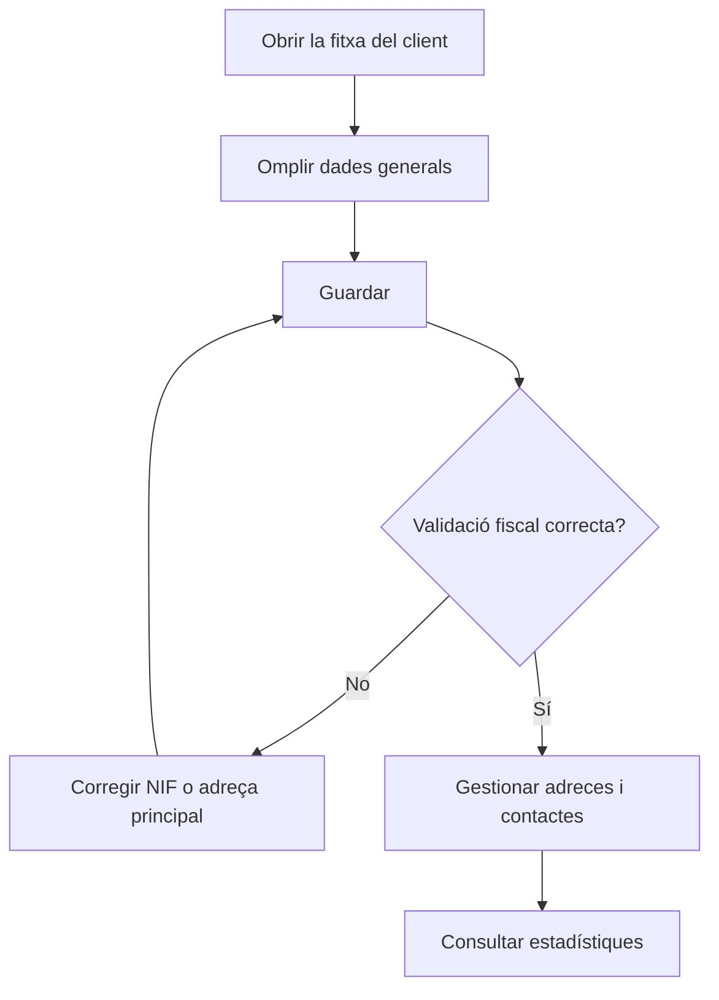

# Client

## Per a que serveix aquesta pantalla

És la fitxa d'un client: hi mantens les dades comercials i fiscals, els contactes, les adreces i un resum de l'activitat de l'any. Aquestes dades es copien als pressupostos, comandes, albarans i factures, i les dades fiscals es validen abans de poder facturar.

Quan s'entra des del botó «+» de «Clients», la pantalla surt amb el títol «Alta de client» i només mostra la pestanya de dades generals.

## Accions disponibles

- Omplir o modificar les dades generals a la pestanya «Clients» i desar-les amb «Guardar», a la capçalera.
- Gestionar les persones de contacte a la pestanya «Contactes»: afegir-ne amb «+», editar-ne fent clic a la fila i eliminar-ne amb la paperera.
- Gestionar les adreces a la pestanya «Adreces»: afegir, editar, marcar-ne una com a «Principal» o «Desactivada» i eliminar-ne.
- Consultar l'activitat de l'any a la pestanya «Estadístiques».

## Flux habitual

1. Omple «Nom comercial», «Nom fiscal», «Tipus Client», «NIF/CIF» i «Número de compte».
2. Tria l'«Idioma» dels documents del client i, si cal, la «Forma de pagament».
3. Prem «Guardar».
4. A «Adreces», prem «+», informa «Nom», «País», «Direcció», «Ciutat», «Província» i «Codi postal», i prem «Guardar».
5. A «Contactes», afegeix les persones de contacte amb «Nom», «Cognoms», «Correu electrònic» i «Telèfon».
6. Consulta «Estadístiques» per veure pressupostos i facturació de l'any.

## Aspectes importants

- Camps obligatoris del formulari: «Nom comercial», «Nom fiscal», «Tipus Client», «NIF/CIF» i «Número de compte».
- En desar, el sistema valida les dades fiscals: el «NIF/CIF» ha de ser un NIF o CIF espanyol vàlid, i el nom fiscal i el número de compte han d'estar informats. En l'alta el client encara no té adreces; a partir de llavors, cada vegada que desis el client ha de tenir una adreça principal amb país, codi postal, ciutat i direcció informats. Si alguna condició falla, no es desa res.
- Un client sense adreça principal no es pot fer servir en albarans ni en factures: afegeix-la a «Adreces» just després de l'alta.
- No es poden tenir dos clients amb el mateix nom comercial.
- Les pestanyes «Contactes», «Adreces» i «Estadístiques» només apareixen quan el client ja existeix.
- L'«Idioma» del client és l'idioma en què es generen els seus documents: pressupost, comanda, albarà i factura.
- La primera adreça activa que afegeixes queda marcada com a principal automàticament. Si cap adreça està marcada com a principal, s'utilitza la primera adreça activa.
- En desar una adreça, el sistema en calcula les coordenades i la distància des del centre de l'empresa. Aquesta distància s'utilitza per proposar tarifes de transport als pressupostos.
- A «Contactes», la casella «Predeterminat» marca el contacte principal del client.
- «Estadístiques» mostra dades de l'any natural en curs: nombre de pressupostos, acceptats i rebutjats, nombre de factures, total facturat sense impostos i un gràfic de facturació mensual. «Rebutjats» compta tots els pressupostos sense data d'acceptació, també els que encara estan pendents.
- Eliminar un contacte o una adreça és definitiu; per deixar de fer servir una adreça sense perdre-la, marca-la com a «Desactivada».

## Errors frequents

- Si apareix «CIF/NIF invàlid», revisa el format del «NIF/CIF».
- Si apareix «El client no té direccions donades d'alta. Si us plau, crei una direcció.», el client no té cap adreça activa. Afegeix-ne una a «Adreces» i torna a desar.
- Si apareix «La direcció fiscal principal del client és incompleta...», completa país, codi postal, ciutat i direcció de l'adreça principal.
- Si apareix «El client no és vàlid per a crear una factura...», revisa «Nom fiscal», «Número de compte» i «NIF/CIF».
- Si l'alta falla perquè el client ja existeix, ja hi ha un client amb aquest nom comercial: cerca'l a «Clients».
- Si una adreça no es desa, revisa els camps obligatoris: nom, país, direcció, ciutat, província i codi postal.

## Proces basic

```mermaid
flowchart TD
    A[Obrir la fitxa del client] --> B[Omplir dades generals]
    B --> C[Guardar]
    C --> D{Validació fiscal correcta?}
    D -->|No| E[Corregir NIF o adreça principal]
    E --> C
    D -->|Sí| F[Gestionar adreces i contactes]
    F --> G[Consultar estadístiques]
```
