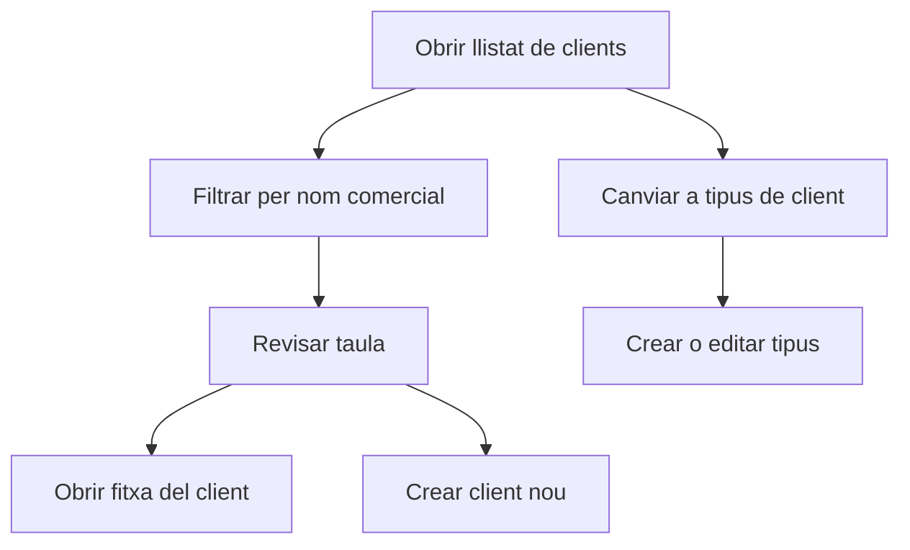

# Clients

## Per a que serveix aquesta pantalla

La pantalla de clients permet consultar el llistat de clients i gestionar, des de la mateixa vista, el cataleg de tipus de client. Es el punt d'entrada habitual per localitzar una fitxa comercial o donar d'alta un client nou.

## Accions disponibles

- Filtrar clients per nom comercial.
- Obrir la fitxa d'un client existent.
- Crear un client nou.
- Eliminar un client.
- Canviar a la pestanya de tipus de client.
- Crear, obrir i eliminar tipus de client.

## Flux habitual

1. Cerca el client pel nom comercial si vols reduir la llista.
2. Revisa les dades principals a la taula.
3. Fes clic a la fila per obrir la fitxa del client.
4. Si has de donar-lo d'alta, prem el boto `+`.
5. Si necessites mantenir la classificacio comercial, ves a la pestanya `Tipus de client`.

## Aspectes importants

- El boto `+` no fa sempre la mateixa accio: crea un client o un tipus de client segons la pestanya activa.
- La gestio de tipus de client viu dins aquesta pantalla, encara que existeixi una ruta de detall per editar cada tipus.
- Fer clic sobre una fila obre el detall; la icona `X` s'utilitza per eliminar.
- Els tipus de client serveixen per classificar clients i no substitueixen la fitxa comercial ni fiscal.

## Errors frequents

- Si no trobes un client, comprova primer el filtre de nom comercial.
- Si no pots eliminar un client o un tipus, pot estar relacionat amb altres documents o registres.
- Si la pestanya `Tipus de client` no mostra dades, torna a carregar la pantalla o revisa que la carrega inicial s'hagi completat.
- Si el boto `+` obre una pantalla diferent de la que esperaves, revisa quina pestanya tens activa.

## Proces basic

