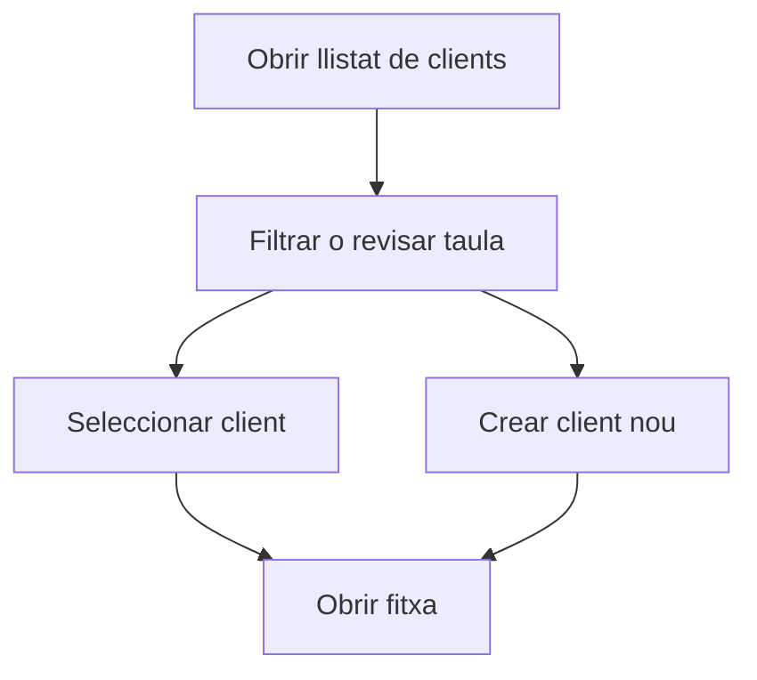

# Clients

## Per a que serveix aquesta pantalla

Aquesta pantalla permet consultar el llistat de clients i accedir rapidament a la seva fitxa. Tambe hi pots gestionar els tipus de client des de la segona pestanya.

## Accions disponibles

- Crear un client nou.
- Obrir la fitxa d'un client existent.
- Filtrar per nom comercial.
- Eliminar un client o un tipus de client quan correspongui.
- Consultar i editar els tipus de client.

## Flux habitual

1. Cerca el client pel nom comercial.
2. Revisa les dades principals a la taula.
3. Fes clic a la fila per obrir el detall.
4. Si cal, crea un client nou amb el boto superior.

## Errors frequents

- Si no trobes un client, comprova primer el filtre de nom comercial.
- Si no pots eliminar un registre, pot estar relacionat amb altres documents.
- Si la segona pestanya no mostra dades, torna a carregar els tipus de client.

## Proces basic

