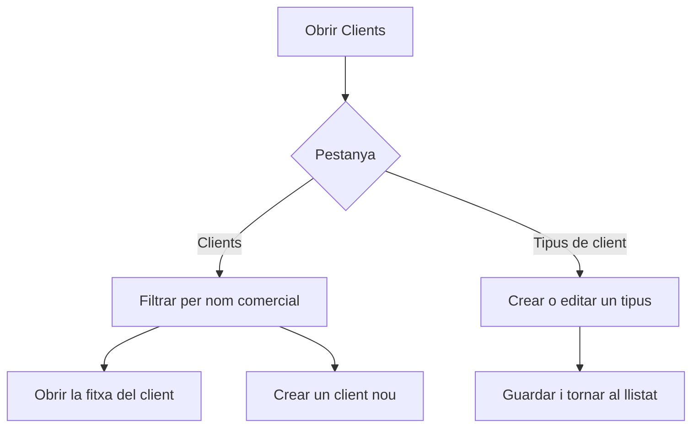

# Clients

## Per a que serveix aquesta pantalla

És el llistat de clients de vendes i el punt de partida per obrir o donar d'alta la fitxa d'un client. El client és la base de tot el flux comercial (pressupost -> comanda -> albarà -> factura): cada document de venda es crea per a un client concret.

La pantalla té dues pestanyes: «Clients», amb el llistat de clients, i «Tipus de client», on es manté el catàleg de tipus que serveix per classificar-los.

## Accions disponibles

- Cercar un client pel «Nom comercial» amb el filtre de la capçalera; la llista es filtra mentre escrius.
- Netejar el filtre amb «Netejar».
- Crear un client nou amb el botó «+» («Crear nou»): s'obre una fitxa de client buida.
- Obrir la fitxa d'un client fent clic a la fila.
- Eliminar un client amb la icona de paperera («Eliminar») de la fila, després de confirmar-ho.
- Canviar a la pestanya «Tipus de client» per consultar, crear, editar o eliminar tipus.
- Adaptar les columnes i desar vistes amb la icona d'engranatge («Configuració de la vista»).

## Flux habitual

1. Obre «Clients» i escriu part del nom comercial al filtre.
2. Revisa a la taula el «Nom fiscal», el «CIF» i el «Tipus» del client.
3. Fes clic a la fila per obrir la fitxa i revisar-ne les dades, els contactes i les adreces.
4. Si el client no existeix, prem «+» i omple la fitxa (vegeu l'ajuda de la fitxa de client).
5. Si falta un tipus de client, ves a «Tipus de client», prem «+», informa «Nom» i «Descripció» i prem «Guardar».

## Aspectes importants

- El filtre només cerca pel nom comercial, no pel nom fiscal ni pel CIF.
- El botó «+» crea un client o un tipus de client segons la pestanya activa.
- Tipus de client: cada tipus té «Nom» i «Descripció», tots dos obligatoris (màxim 250 caràcters). No es pot crear un tipus amb un nom que ja existeix. En desar, la pantalla torna al llistat.
- Tots els clients han de tenir un tipus: a la fitxa, el camp «Tipus Client» és obligatori i les opcions surten d'aquesta pestanya.
- L'eliminació d'un client és definitiva, no una baixa: també s'esborren els seus contactes i adreces. Per això no es pot eliminar un client que tingui pressupostos, comandes, albarans, factures o referències.
- L'eliminació d'un tipus de client també és definitiva, i no es pot eliminar un tipus que tingui clients assignats. Abans d'eliminar un tipus, canvia el tipus dels seus clients.
- La columna «Desactivat» es mostra a la taula, però la fitxa de client no permet canviar-la.

## Errors frequents

- Si no trobes un client, comprova el filtre: busca només dins del nom comercial. Prem «Netejar» i torna-ho a provar.
- Si en desar un tipus nou apareix «L'entitat ja existeix», ja hi ha un tipus amb aquest nom.
- Si «+» obre una pantalla diferent de l'esperada, revisa quina pestanya tens activa.
- Si surt «No s'ha pogut eliminar el client ...» o «No s'ha pogut eliminar el tipus de client ...», el client té documents o el tipus té clients assignats: el client s'ha de conservar, i el tipus només es pot eliminar després de canviar el tipus dels seus clients.

## Proces basic

```mermaid
flowchart TD
    A[Obrir Clients] --> B{Pestanya}
    B -->|Clients| C[Filtrar per nom comercial]
    C --> D[Obrir la fitxa del client]
    C --> E[Crear un client nou]
    B -->|Tipus de client| F[Crear o editar un tipus]
    F --> G[Guardar i tornar al llistat]
```
