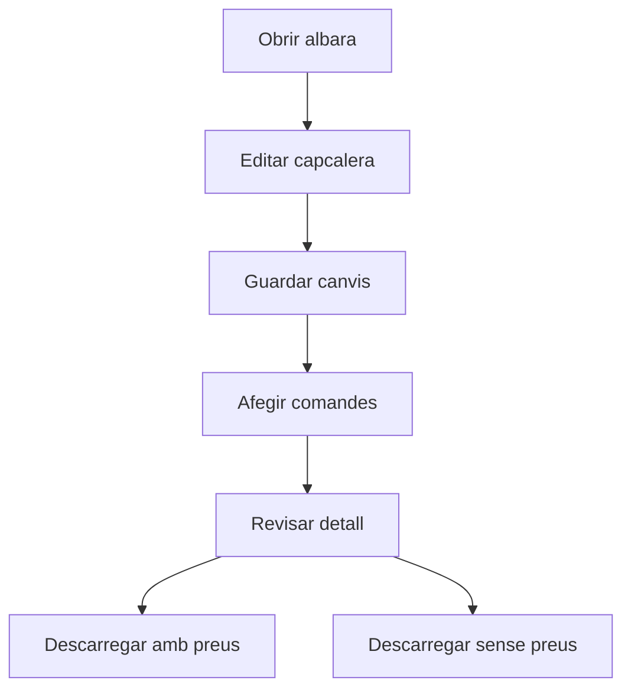

# Albara d'entrega

## Per a que serveix aquesta pantalla

La fitxa d'albara permet mantenir la capcalera del lliurament i associar-hi comandes de venda. Des d'aqui tambe pots descarregar el document amb o sense preus i revisar quines comandes formen part de l'entrega.

## Accions disponibles

- Guardar canvis de la capcalera.
- Descarregar l'albara amb preus.
- Descarregar l'albara sense preus.
- Afegir comandes a l'albara.
- Treure comandes de l'albara mentre el detall sigui modificable.

## Flux habitual

1. Revisa o completa les dades generals de l'albara.
2. Desa la capcalera si has fet canvis.
3. Afegeix les comandes pendents d'entrega del client.
4. Revisa el detall agrupat per comandes.
5. Descarrega el document final amb o sense preus segons l'us que en facis.

## Aspectes importants

- Aquesta pantalla no treballa amb linies lliures. El detall es construeix a partir de comandes associades.
- Si l'albara ja esta vinculat a una factura, el detall deixa de ser modificable.
- Quan l'estat de l'albara ja no correspon a la situacio inicial o ja consta com a entregat, el sistema pot bloquejar modificacions del detall.
- Quan elimines una comanda del detall, estas desassignant la comanda completa de l'albara.

## Errors frequents

- Si no pots afegir o treure comandes, comprova si l'albara ja esta facturat o bloquejat per estat.
- Si no apareixen comandes al selector, pot ser que el client no tingui comandes pendents d'entrega.
- Si no pots guardar, revisa les dades obligatories de la capcalera.
- Si la descarrega falla, comprova que l'albara estigui correctament informat.

## Proces basic

