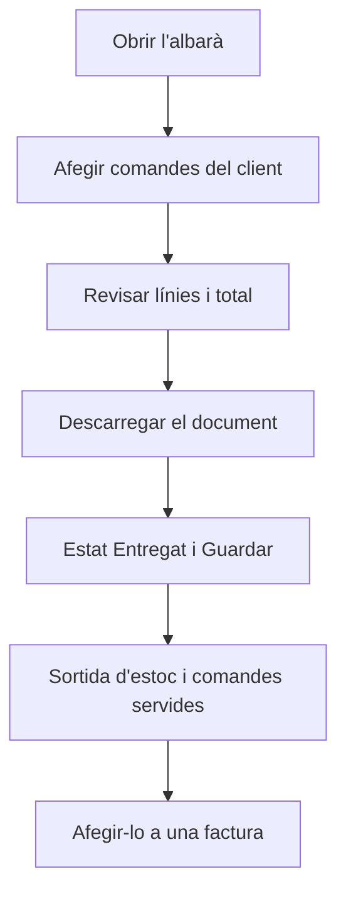

# Albarà d'entrega

## Per a que serveix aquesta pantalla

És la fitxa d'un albarà d'entrega. Hi afegeixes les comandes del client que s'entreguen, marques l'albarà com a entregat (el que fa sortir l'estoc del magatzem) i en descarregues el document. Després, l'albarà entregat s'afegeix a una factura: `pressupost -> comanda -> albarà -> factura`.

## Accions disponibles

- Desar la capçalera amb «Guardar». En desar, tornes a la pantalla anterior.
- Obrir el menú de la fletxa del botó «Guardar» per a:
  - «Descarregar»: l'albarà en Word, amb preus.
  - «Imprimir PDF»: l'albarà en PDF, amb preus.
  - «Descarregar sense preu»: l'albarà en Word, sense preus.
- Afegir comandes amb el botó «Crear comanda» de la capçalera de les línies. S'obre el «Selector de comandes», on marques les comandes i confirmes amb el botó de la marca. Amb «Cercar» filtres per número de comanda o per número de comanda del client.
- Treure una comanda de l'albarà amb la creu de la capçalera del seu grup de línies.
- Entregar l'albarà: canvia l'«Estat» a «Entregat» i prem «Guardar».
- Desfer l'entrega: canvia l'«Estat» d'«Entregat» a un altre estat i prem «Guardar».
- Obrir la fitxa del client amb la lupa del costat del camp «Client».

## Flux habitual

1. Obre l'albarà, normalment creat des de la comanda amb «Crear albarà».
2. Si s'entreguen més comandes del mateix client, prem «Crear comanda», marca-les al selector i confirma.
3. Revisa les línies agrupades per comanda i el total.
4. Descarrega l'albarà sense preu per acompanyar la mercaderia, si cal.
5. Quan la mercaderia surt, canvia l'«Estat» a «Entregat» i prem «Guardar».
6. Després, afegeix l'albarà a una factura des de «Factures de venda».

## Aspectes importants

- «Número Albarà», «Data creació» i «Número de factura» són de només lectura. «Número de factura» mostra la factura on és l'albarà.
- Les línies no s'editen aquí: es copien de les línies de la comanda en afegir-la. Si una línia no és correcta, treu la comanda, corregeix-la i torna-la a afegir.
- El selector només mostra comandes d'aquest client que encara no són en cap albarà. Una comanda només pot estar en un albarà.
- Treure una comanda n'esborra les línies de l'albarà i torna la comanda a l'estat «Comanda», lliure per a un altre albarà.
- L'estat només es pot canviar cap a «Entregat» o des d'«Entregat». Qualsevol altre canvi es rebutja.
- En entregar l'albarà:
  - Surt de l'estoc la quantitat de cada línia, a la ubicació per defecte, amb un moviment «Albarà» i el número. Les referències de servei no mouen estoc.
  - Si la referència treballa amb lots, s'usa el lot de l'ordre de fabricació que va produir la línia, o se'n resol un.
  - Les comandes de l'albarà passen a «Comanda Servida».
  - Si la «Data Entrega» és buida, s'hi posa la data d'avui.
- En desfer l'entrega, l'estoc torna a entrar amb un moviment «Retorn albarà», les comandes tornen a «Comanda» i la «Data Entrega» es buida.
- Un albarà entregat té el client i la data d'entrega bloquejats, no admet afegir ni treure comandes, i «Guardar» només s'activa si canvies l'estat.
- Un albarà facturat queda tancat: l'estat es bloqueja i «Guardar» es desactiva, però les descàrregues continuen disponibles. Per modificar-lo, primer cal treure'l de la factura.
- Els moviments d'estoc es poden consultar a «Moviments de magatzem».

## Errors frequents

- Si surt «No es pot editar un albarà entregat», desfés primer l'entrega canviant l'estat i desant.
- Si surt «L'estat de l'albarà només es pot canviar mitjançant l'acció d'entrega», tria «Entregat» o, si ja ho està, un altre estat per desfer l'entrega.
- Si surt «No es pot desfer l'entrega d'un albarà facturat», treu primer l'albarà de la factura, a «Factures de venda».
- Si el selector de comandes surt buit, el client no té comandes pendents d'albarà: comprova a «Comandes» que existeixin i que no siguin ja en un altre albarà.
- Si surt «La comanda ja està assignada a un altre albarà», treu-la primer de l'altre albarà.
- Si en entregar surt «No hi ha una ubicació per defecte definida al projecte», avisa l'administrador: cal configurar la ubicació per defecte del magatzem.
- Si en desfer l'entrega surt «El lot ja està tancat i no es pot reobrir», el lot de la línia s'ha tancat i l'estoc no hi pot tornar.

## Proces basic

```mermaid
flowchart TD
    A[Obrir l'albarà] --> B[Afegir comandes del client]
    B --> C[Revisar línies i total]
    C --> D[Descarregar el document]
    D --> E[Estat Entregat i Guardar]
    E --> F[Sortida d'estoc i comandes servides]
    F --> G[Afegir-lo a una factura]
```
