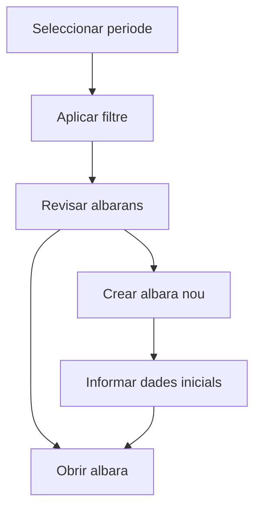

# Albarans d'entrega

## Per a que serveix aquesta pantalla

La pantalla d'albarans d'entrega permet consultar els albarans del periode seleccionat, filtrar-los per client i crear albarans nous. Es el punt de control previ a la facturacio dels lliuraments.

## Accions disponibles

- Seleccionar un periode de treball.
- Filtrar per client.
- Netejar els filtres actius.
- Crear un albara nou.
- Obrir un albara existent.
- Eliminar un albara si encara es troba en l'estat inicial.

## Flux habitual

1. Selecciona el periode que vols revisar.
2. Aplica el filtre de client si el necessites.
3. Prem el boto de filtre per carregar els albarans.
4. Obre un albara existent o crea'n un de nou des del boto `+`.
5. Si el crees des de la llista, informa primer les dades basiques al dialeg inicial.

## Aspectes importants

- La pantalla recorda els filtres de l'usuari, de manera que en tornar pots recuperar el mateix context.
- La creacio manual d'un albara conviu amb la generacio d'albarans des de comandes.
- La icona d'eliminar nomes es mostra quan l'albara es troba a l'estat inicial del seu cicle de vida.
- L'albara es una baula intermedia entre la comanda i la factura, per tant les seves modificacions poden quedar condicionades per processos posteriors.

## Errors frequents

- Si no es mostren dades, comprova que hi hagi un periode seleccionat.
- Si no trobes un albara, revisa el filtre de client.
- Si no es pot crear, valida les dades minimes del dialeg inicial.
- Si no es pot eliminar, pot ser que l'albara ja hagi avancat d'estat o tingui processos associats.

## Proces basic

