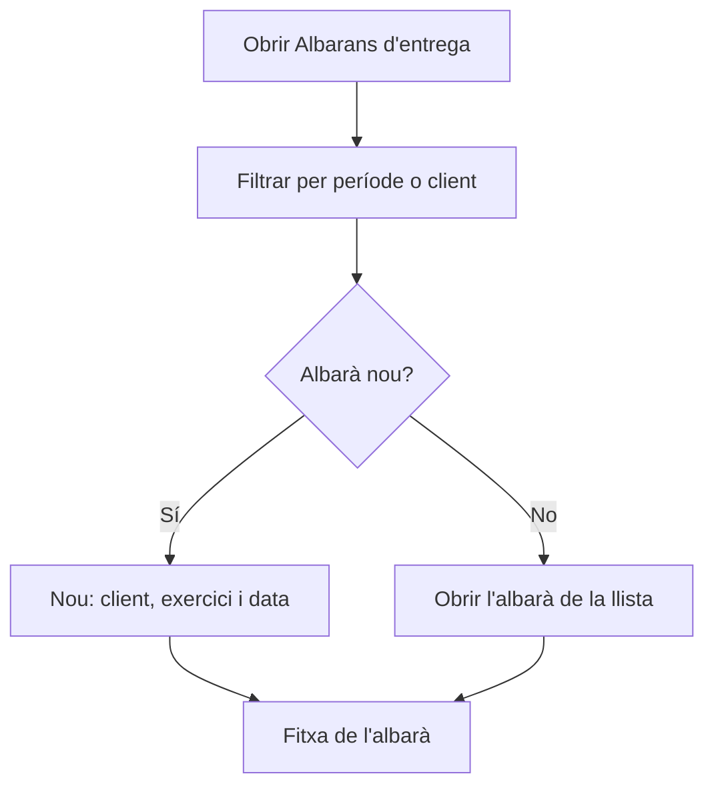

# Albarans d'entrega

## Per a que serveix aquesta pantalla

És la llista dels albarans d'entrega als clients. Hi cerques els albarans d'un període, els filtres per client, n'obres un o en crees un de nou. L'albarà és el document que registra l'entrega de les comandes i el que després es factura: `pressupost -> comanda -> albarà -> factura`.

## Accions disponibles

- Filtrar per «Període» i «Client», i aplicar el filtre amb «Filtrar».
- Restablir els filtres amb «Netejar»: treu el client i torna el període a l'any en curs. Després prem «Filtrar» per recarregar la llista.
- Crear un albarà buit amb «Nou»: s'obre el diàleg «Crear albarà», on tries el «Client», l'«Exercici» i la «Data».
- Obrir un albarà fent clic a la fila.
- Eliminar un albarà amb la icona de la paperera («Eliminar»), després de confirmar-ho.

La taula mostra el «Número», la «Data de creació», la «Data d'entrega», el «Client» i l'«Estat».

## Flux habitual

1. Obre «Albarans d'entrega». Es carreguen els albarans creats durant l'any en curs.
2. Ajusta el període o el client i prem «Filtrar».
3. Obre l'albarà que vols revisar, entregar o descarregar.
4. Si has de crear un albarà a mà, prem «Nou», tria el client, revisa l'exercici i la data i confirma.
5. A la fitxa que s'obre, afegeix-hi les comandes del client que s'entreguen.

## Aspectes importants

- El període filtra per la data de creació de l'albarà, no per la data d'entrega. Sense un període complet la llista no es carrega i surt l'avís «Selecciona un període».
- Aquesta llista no recorda els filtres: cada vegada que hi entres torna a l'any en curs sense client.
- La manera habitual de crear un albarà és des de la fitxa de la comanda, amb «Crear albarà». Des d'aquí es crea buit i les comandes s'hi afegeixen després.
- El número de l'albarà el posa el sistema amb el comptador de l'exercici triat, i l'albarà neix a l'estat inicial del seu cicle de vida («Cicles de vida»).
- El client ha de tenir el nom fiscal, el NIF, el número de compte i almenys una adreça activa, i la seu per defecte de l'empresa ha de tenir les dades de facturació completes.
- La paperera només surt als albarans que són a l'estat inicial i no estan facturats. A més, no es pot eliminar un albarà entregat ni un que encara tingui comandes: primer cal treure-les des de la seva fitxa.
- Eliminar un albarà l'esborra definitivament.

## Errors frequents

- Si surt «Selecciona un període», indica una data d'inici i una de fi i torna a prémer «Filtrar».
- Si en eliminar surt «No es pot eliminar un albarà amb comandes associades», obre l'albarà, treu-ne les comandes amb la creu de cada grup i torna-ho a provar.
- Si surt «No es pot eliminar un albarà entregat» o «No es pot eliminar un albarà facturat», l'albarà ja forma part del circuit d'entrega o de facturació i no s'ha d'esborrar.
- Si en crear l'albarà surt «El client no és vàlid per a crear una factura», completa el nom fiscal, el NIF i el número de compte del client a «Clients».
- Si surt «El client no té direccions donades d'alta», afegeix una adreça al client.
- Si no trobes un albarà, recorda que el període es compara amb la data de creació.

## Proces basic

```mermaid
flowchart TD
    A[Obrir Albarans d'entrega] --> B[Filtrar per període o client]
    B --> C{Albarà nou?}
    C -->|Sí| D[Nou: client, exercici i data]
    D --> E[Fitxa de l'albarà]
    C -->|No| F[Obrir l'albarà de la llista]
    F --> E
```
