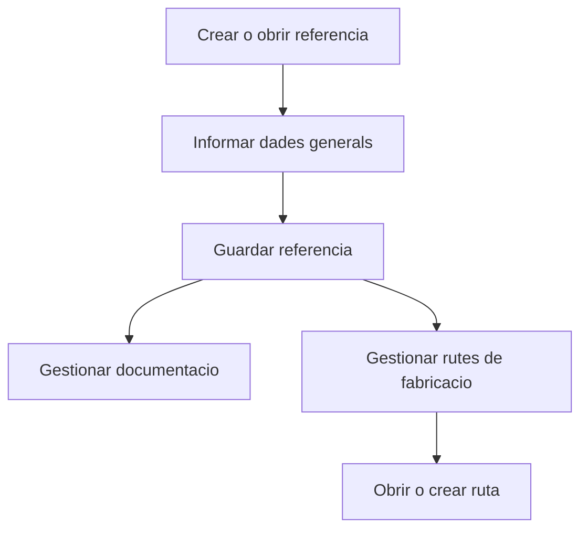

# Referencia de venda

## Per a que serveix aquesta pantalla

La fitxa de referencia permet mantenir la definicio d'una referencia comercial i, quan ja existeix, gestionar la seva documentacio i les rutes de fabricacio associades. Es una pantalla compartida entre necessitats comercials i informacio de produccio.

## Accions disponibles

- Crear una referencia nova.
- Editar una referencia existent.
- Adjuntar o consultar documentacio vinculada.
- Crear una ruta de fabricacio associada.
- Obrir una ruta de fabricacio existent.
- Eliminar una ruta de fabricacio.

## Flux habitual

1. Informa o revisa les dades generals de la referencia.
2. Desa la referencia.
3. Si la referencia ja existeix, afegeix documentacio complementaria.
4. Si cal planificacio productiva, crea o revisa les rutes de fabricacio vinculades.

## Aspectes importants

- Quan entres amb un identificador nou i la referencia encara no existeix, la pantalla funciona en mode alta.
- La pestanya `Rutes de fabricacio` nomes apareix quan la referencia ja ha estat creada.
- El sistema valida que la combinacio de referencia i versio no estigui duplicada.
- La fitxa es especialment rellevant quan una referencia comercial necessita suport de documentacio tecnica o definicio productiva.

## Errors frequents

- Si no pots desar una referencia nova, revisa si la combinacio de codi i versio ja existeix.
- Si no apareixen rutes de fabricacio, comprova que la referencia s'hagi creat correctament abans.
- Si l'eliminacio d'una ruta falla, el sistema recarrega l'estat real per evitar inconsistencies visuals.
- Si la documentacio no apareix, valida que s'estigui treballant sobre la referencia correcta.

## Proces basic

