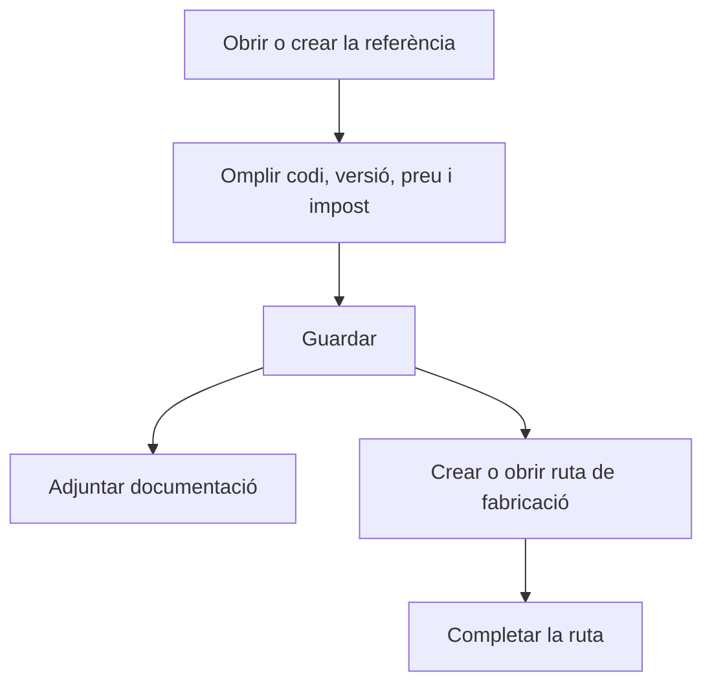

# Referència

## Per a que serveix aquesta pantalla

És la fitxa d'una referència de venda. Hi defineixes el codi, la versió, el preu, l'impost i, si és una peça exclusiva, el client. També hi adjuntes la documentació tècnica i crees les rutes de fabricació que en calculen el cost i que després fan servir els pressupostos i les ordres de fabricació.

Quan s'entra des del botó «+» de «Referències de venda», la pantalla surt amb el títol «Alta de referència».

## Accions disponibles

- Omplir les dades de la referència i desar-les amb «Guardar», a la capçalera.
- Pujar, consultar i descarregar documents a la pestanya «Documentació».
- A la pestanya «Rutes de fabricació»:
  - Crear una ruta nova amb el botó «+»: es crea i s'obre la ruta per completar-la.
  - Obrir una ruta existent fent clic a la fila.
  - Eliminar una ruta amb la «X», després de confirmar-ho.

## Flux habitual

1. Informa «Codi», «Descripció» i «Versió».
2. Tria el «Tipus de material» i, si la peça és exclusiva d'un client, el «Client».
3. Informa el «Preu unitari» i l'«Impost»; marca «Servei» si no és una peça física.
4. Prem «Guardar»: la referència queda creada i apareix la pestanya «Rutes de fabricació».
5. Adjunta plànols o especificacions a «Documentació».
6. A «Rutes de fabricació», prem «+» i completa la ruta a la pantalla que s'obre.

## Aspectes importants

- Camps obligatoris: «Codi» (màxim 50 caràcters), «Descripció» (màxim 250), «Versió» (màxim 20), «Preu unitari» i «Impost».
- Una referència nova comença amb la «Versió» 1.
- «Cost Teòric Fabricació» i «Cost Última Fabricació» són de només lectura. El primer s'actualitza en desar la ruta de fabricació de la referència; el segon, amb els costos de les ordres de fabricació.
- El «Preu unitari» és el preu que es proposa en afegir la referència a una línia de pressupost quan no hi ha costos calculats.
- Si informes el «Client», la referència només s'ofereix a les línies dels pressupostos d'aquest client; sense client, s'ofereix a tots.
- La pestanya «Rutes de fabricació» només apareix quan la referència ja està desada. La taula mostra, per a cada ruta, «Quantitat base», «Cost màquina», «Cost operari», «Cost material», «Cost extern» i «Cost total».
- En desar una referència nova, et quedes a la fitxa per continuar amb la documentació i les rutes. En desar una referència existent, la pantalla torna a la pantalla anterior.
- Una referència amb ruta de fabricació no es pot eliminar des de «Referències de venda»: primer cal eliminar-ne les rutes.

## Errors frequents

- Si en crear surt «La referència i versió introduïdes ja existeixen», la referència no s'ha pogut crear; revisa les dades i torna a desar.
- Si el formulari no es desa, revisa els missatges dels camps: «El codi és obligatori», «La versió és obligatòria», «El preu és obligatori» o «El tipus d'IVA és obligatori».
- Si surt «Error en crear la ruta de fabricació», torna a provar-ho i comprova que la referència estigui desada.
- Si surt «No s'ha pogut eliminar la ruta», la ruta no s'ha eliminat i torna a aparèixer a la taula; comprova si la ruta s'utilitza en pressupostos, comandes o ordres de fabricació.

## Proces basic

```mermaid
flowchart TD
    A[Obrir o crear la referència] --> B[Omplir codi, versió, preu i impost]
    B --> C[Guardar]
    C --> D[Adjuntar documentació]
    C --> E[Crear o obrir ruta de fabricació]
    E --> F[Completar la ruta]
```
